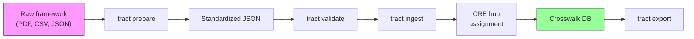
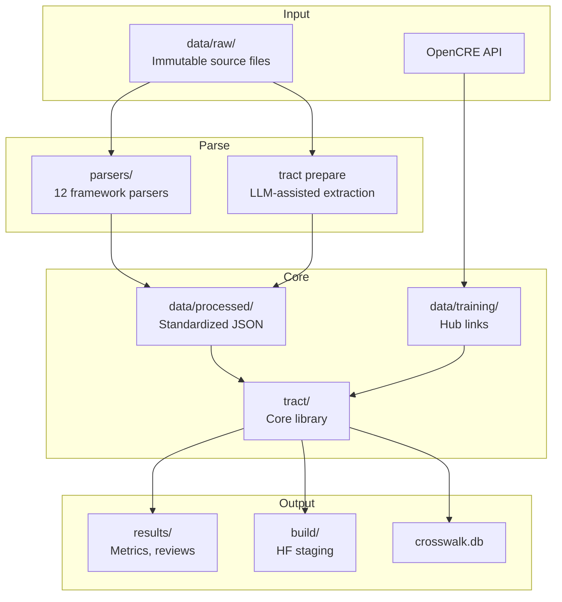

# TRACT — Translating Requirements Across CRE Trees

[](LICENSE)
[](https://www.python.org/downloads/)
[](https://huggingface.co/rockCO78/tract-cre-assignment)
[](https://huggingface.co/datasets/rockCO78/tract-crosswalk-dataset)

TRACT assigns security framework controls to positions in the [OpenCRE](https://opencre.org) hierarchy using a fine-tuned bi-encoder, creating transitive crosswalks between any pair of frameworks automatically.

## The Problem

Security frameworks define overlapping requirements independently. NIST 800-53, MITRE ATLAS, OWASP, CSA, and the EU AI Act each describe AI security controls in their own terminology. Practitioners manually crosswalk between them — a process that is slow, error-prone, and breaks every time a framework updates.

## The Solution

TRACT treats crosswalk construction as a **hub assignment problem**: each control is independently mapped to a CRE hub — a node in OpenCRE's universal security taxonomy. Controls from different frameworks that map to the same hub are crosswalked transitively.

```
g(control_text) → CRE_hub_position     # NOT pairwise f(A, B) → similarity
```

This scales linearly (not quadratically) with the number of controls, and adding a new framework automatically crosswalks it with every existing framework.



> **What is OpenCRE?** The [Open Common Requirement Enumeration](https://opencre.org) is a community-maintained taxonomy that organizes security requirements into a hierarchy of 400+ hubs. It links controls from NIST, OWASP, CWE, ISO 27001, and dozens of other frameworks. TRACT uses it as the universal coordinate system for security controls.

## Key Results

| Metric | Value |
|--------|-------|
| **Assignment accuracy (hit@1)** | 0.537 [0.463, 0.612] |
| **Improvement over zero-shot** | +0.139 (baseline: 0.399) |
| **Crosswalk assignments** | 5,238 across 31 frameworks |
| **Assignment breakdown** | 4,390 ground truth · 528 expert-reviewed · 320 model predictions |
| **AI↔traditional bridges** | 46 accepted (of 63 candidates) |
| **Evaluation** | LOFO cross-validation with hub firewall |

All metrics use 95% bootstrap confidence intervals (10,000 resamples). Full experiment narrative in [`tract_experimental_narrative.ipynb`](tract_experimental_narrative.ipynb).

## Quick Start

**Explore without model artifacts** (works immediately after install):

```bash
git clone https://github.com/rocklambros/TRACT.git
cd TRACT
pip install -e ".[dev]"
tract prepare --file examples/sample_framework.csv --framework-id demo --name "Demo Framework"
tract validate --file demo_prepared.json
```

**Full assignment workflow** (requires trained model artifacts):

```bash
pip install -e ".[phase0]"
tract tutorial                    # Guided walkthrough (checks prerequisites)
tract assign "Implement input validation for AI model training data"
```

> **Note:** `tract assign` and `tract tutorial` require model artifacts from the training pipeline. `tract prepare` and `tract validate` work immediately after install.

## Framework Coverage

TRACT processes **31 frameworks** with **2,802 controls** total.

### AI Security Frameworks (12 frameworks, 977 controls)

| Framework | ID | Controls |
|-----------|----|----------|
| CSA AI Controls Matrix | `csa_aicm` | 243 |
| MITRE ATLAS | `mitre_atlas` | 202 |
| AIUC-1 Standard | `aiuc_1` | 132 |
| EU AI Act | `eu_ai_act` | 126 |
| NIST AI Risk Management Framework | `nist_ai_rmf` | 72 |
| CoSAI AI Security Risk Map | `cosai` | 55 |
| OWASP AI Exchange | `owasp_ai_exchange` | 54 |
| EU GPAI Code of Practice | `eu_gpai_cop` | 40 |
| OWASP GenAI Data Security | `owasp_dsgai` | 21 |
| NIST AI 600-1 GenAI Profile | `nist_ai_600_1` | 12 |
| OWASP Top 10 for LLM | `owasp_llm_top10` | 10 |
| OWASP Top 10 for Agentic Apps | `owasp_agentic_top10` | 10 |

### Traditional Security Frameworks (19 frameworks, 1,825 controls)

| Framework | ID | Controls |
|-----------|----|----------|
| CAPEC | `capec` | 349 |
| NIST 800-53 | `nist_800_53` | 300 |
| ASVS | `asvs` | 277 |
| CWE | `cwe` | 246 |
| DSOMM | `dsomm` | 183 |
| ISO 27001 | `iso_27001` | 93 |
| WSTG | `wstg` | 59 |
| OWASP Cheat Sheets | `owasp_cheat_sheets` | 50 |
| NIST SSDF | `nist_ssdf` | 44 |
| ENISA | `enisa` | 38 |
| SAMM | `samm` | 30 |
| CSA Cloud Controls Matrix | `csa_ccm` | 29 |
| NIST AI 100-2 | `nist_ai_100_2` | 28 |
| ETSI | `etsi` | 27 |
| NIST 800-63 | `nist_800_63` | 25 |
| BIML | `biml` | 20 |
| OWASP Top 10 2021 | `owasp_top10_2021` | 10 |
| OWASP Proactive Controls | `owasp_proactive_controls` | 10 |
| OWASP Top 10 for ML | `owasp_ml_top10` | 7 |

## CLI Overview

All 20 subcommands grouped by workflow stage:

| Stage | Commands | Description |
|-------|----------|-------------|
| **Explore** | `tutorial` `hierarchy` `compare` | Learn TRACT, inspect hubs, compare frameworks |
| **Prepare** | `prepare` `validate` | Extract and validate framework controls |
| **Assign** | `assign` `ingest` `accept` | Map controls to CRE hubs |
| **Review** | `review-export` `review-validate` `review-import` `review-proposals` | Expert review workflow |
| **Analyze** | `bridge` `propose-hubs` `import-ground-truth` | Discover connections, suggest new hubs |
| **Export** | `export` `export-canonical` | Output assignments (CSV, JSON, OpenCRE, canonical snapshot) |
| **Publish** | `publish-hf` `publish-dataset` | Release model and dataset to HuggingFace |
| **Serve** | `api` | Run the REST API server for real-time assignment |

See [`docs/cli-reference.md`](docs/cli-reference.md) for full options and examples.

## REST API

For interactive use or third-party integration, TRACT exposes the assignment model behind a small FastAPI server. The CLI subcommand `tract api` starts uvicorn and serves the model in-process. The API is read-only: predictions are not persisted to `crosswalk.db`. Anyone who wants persistence should keep using `tract ingest`.

The API is opt-in. The base install does not include FastAPI or uvicorn.

```bash
pip install -e ".[api,phase0]"
tract api                                 # binds 127.0.0.1:8000
tract api --host 0.0.0.0 --port 9000      # custom binding
tract api --reload                        # auto-reload during development
```

Once the server is running, the OpenAPI documentation is available at `http://127.0.0.1:8000/docs` and the raw schema at `/openapi.json`.

### Endpoints

All endpoints are versioned under `/v1/`.

| Method | Path | Purpose |
|--------|------|---------|
| `POST` | `/v1/assign` | Assign a single control text to its top-K CRE hubs |
| `POST` | `/v1/assign/batch` | Assign many controls in one request (up to 256) |
| `POST` | `/v1/duplicates` | Find existing controls semantically close to the input |
| `GET`  | `/v1/hubs` | Paginated list of all CRE hubs |
| `GET`  | `/v1/hubs/{hub_id}` | Single hub with its parent and children |
| `GET`  | `/v1/health` | Liveness probe, reports calibration parameters |
| `GET`  | `/v1/version` | Build metadata for client cache-busting and bug reports |

A minimal `/v1/assign` example:

```bash
curl -X POST http://127.0.0.1:8000/v1/assign \
  -H "Content-Type: application/json" \
  -d '{"text":"Implement input validation for user-supplied data","top_k":3}'
```

Response envelopes always include the calibrated confidence (in [0, 1] after temperature scaling), an OOD flag with the underlying similarity score, and the model version. Per-prediction fields include the raw cosine similarity, the conformal-set membership flag, and a 1-indexed rank.

### Configuration

The server reads settings from environment variables prefixed with `TRACT_API_`. CLI flags override the corresponding env var when present.

| Variable | Default | Purpose |
|----------|---------|---------|
| `TRACT_API_HOST` | `127.0.0.1` | Bind address |
| `TRACT_API_PORT` | `8000` | Bind port |
| `TRACT_API_WORKERS` | `1` | Uvicorn worker processes |
| `TRACT_API_MODEL_DIR` | `results/phase1c/deployment_model/` | Where to load model artifacts from |
| `TRACT_API_MODEL_VERSION` | `tract-cre-assignment-v1.0` | Reported in every response |
| `TRACT_API_CORS_ORIGINS` | `*` | Comma-separated allowed origins |
| `TRACT_API_MAX_BATCH_SIZE` | `256` | Hard cap on `/v1/assign/batch` payload |
| `TRACT_API_MAX_TEXT_LENGTH` | `8192` | Hard cap per control text |

GPU users should keep `TRACT_API_WORKERS=1`. Multiple workers each hold their own model in memory and will compete for VRAM. Use batch endpoints for throughput, not parallel workers.

### Security

The v1 API ships without authentication, rate limiting, or per-request audit logging. This is a deliberate choice for a research-stage tool, not an oversight. Three deployment patterns are safe; anything else is not:

- **Localhost only.** The default `TRACT_API_HOST=127.0.0.1` accepts connections only from the same machine. Suitable for developer use and notebook integration.
- **Behind a reverse proxy that handles auth.** Put nginx, Cloudflare Access, Tailscale, or similar in front. Have it terminate TLS, enforce auth, and rate-limit before traffic reaches uvicorn.
- **HuggingFace Spaces.** The Spaces platform fronts the service with TLS and platform-level rate limits at no operational cost.

Do not put `tract api --host 0.0.0.0` on a public IP without one of the patterns above. The model will happily burn CPU or GPU cycles for any caller.

The API also does not log request bodies. Control text submitted by users may describe internal company practices; do not add request-body logging without first reviewing what that data exposure means for your deployment.

### When to use the API vs the CLI

Use the CLI for batch work, reproducible pipelines, and anything that lives in a shell script. Use the API when something else needs to call TRACT programmatically over the wire — a web tool, a Slack bot, a vendor integration. Both surfaces wrap the same underlying model and return identical predictions.

## Project Structure



## Where to Go Next

| I want to... | Go to... |
|-------------|----------|
| Add a new framework | [Framework Guide](docs/framework-guide.md) |
| Understand the model and methodology | [Architecture](docs/architecture.md) |
| Look up a command | [CLI Reference](docs/cli-reference.md) |
| Call TRACT over HTTP | [REST API](#rest-api) |
| Look up a term | [Glossary](docs/glossary.md) |
| Understand canonical export schema | [Architecture § Canonical Export](docs/architecture.md#11-canonical-export-opencre-rfc) |
| Review hub descriptions for quality | [Hub Description Review Guide](docs/hub-description-review-guide.md) |
| Contribute code | [Contributing](CONTRIBUTING.md) |
| Report a security issue | [Security Policy](SECURITY.md) |

## Published Artifacts

- **Model:** [rockCO78/tract-cre-assignment](https://huggingface.co/rockCO78/tract-cre-assignment) on HuggingFace
- **Dataset:** [rockCO78/tract-crosswalk-dataset](https://huggingface.co/datasets/rockCO78/tract-crosswalk-dataset) on HuggingFace
- **Experimental narrative:** [`tract_experimental_narrative.ipynb`](tract_experimental_narrative.ipynb) — 14-section Jupyter notebook covering the complete research journey

## Canonical Export (OpenCRE RFC)

TRACT produces per-framework canonical JSON snapshots designed for [OpenCRE's incremental import RFC](https://github.com/OWASP/OpenCRE/blob/main/docs/designs/easier-importing.md). Each framework export contains:

- **`snapshot.json`** — A `StandardSnapshot` with all controls, CRE mappings, filter policy, and a SHA-256 content hash for integrity verification
- **`changeset.json`** — A keyed diff against the prior export with 6 operation types (ADD/UPDATE/DELETE for controls and mappings), impact analysis, and scope classification
- **`embeddings.npz`** (optional) — Per-framework embedding slice from the deployment model

### StandardSnapshot Schema

| Field | Type | Description |
|-------|------|-------------|
| `schema_version` | string | Always "1.0" |
| `framework_id` | string | Framework identifier (e.g., `csa_aicm`) |
| `framework_name` | string | Human-readable name |
| `export_date` | string | ISO 8601 UTC timestamp |
| `content_hash` | string | SHA-256 of all non-volatile fields |
| `tract_version` | string | Git SHA of TRACT at export time |
| `model_adapter_hash` | string | SHA-256 of the LoRA adapter weights |
| `filter_policy` | object | Confidence floor, OOD/ground-truth exclusion rules |
| `controls` | array | `CanonicalControl` objects (id, title, description, hyperlink) |
| `mappings` | array | `CREMapping` objects (control→hub with confidence, rank, provenance) |

### Changeset Operations

| Operation | Description |
|-----------|-------------|
| `ADD_CONTROL` | New control added to framework export |
| `UPDATE_CONTROL` | Control title, description, or hyperlink changed |
| `DELETE_CONTROL` | Control removed from export |
| `ADD_MAPPING` | New control→hub mapping added |
| `UPDATE_MAPPING` | Mapping confidence, rank, or provenance changed |
| `DELETE_MAPPING` | Mapping removed |

```bash
# Preview canonical export
tract export-canonical --dry-run

# Export a single framework with embeddings
tract export-canonical --framework csa_aicm --with-embeddings

# Export all eligible frameworks
tract export-canonical
```

See [`docs/cli-reference.md`](docs/cli-reference.md) for full options.

## License

[CC0 1.0 Universal](LICENSE) — dedicated to the public domain.
