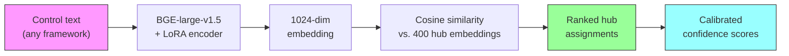
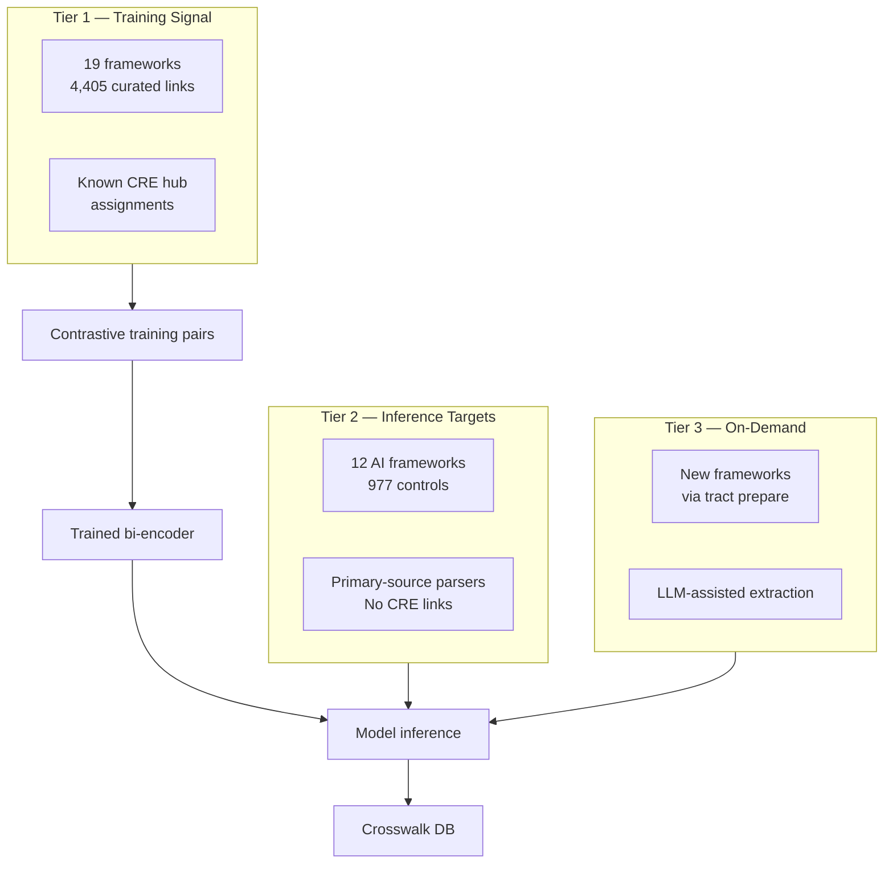
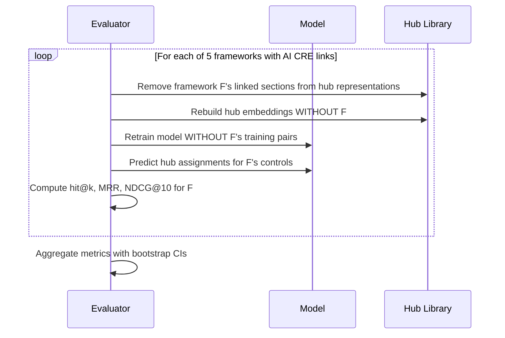

# TRACT Architecture

How TRACT assigns security framework controls to OpenCRE hubs using contrastive fine-tuning.

> **Reading guide:** This document covers the full technical approach. If you're a security practitioner, look for the **"For practitioners"** callouts — they translate ML concepts into security implications. If you're an ML researcher, the methodology sections (3–7) are where the interesting decisions live.

## 1. The Assignment Paradigm

TRACT's core principle: every control is mapped *independently* to a position in the OpenCRE hierarchy.

```
g(control_text) → CRE_hub_position
```

This is deliberately **not** pairwise comparison (`f(control_A, control_B) → similarity`). Pairwise comparison scales as O(n²) — with 2,802 controls across 31 frameworks, that's ~3.9 million comparisons. Assignment scales as O(n) — each control is embedded once and matched against the hub library.

The crosswalk emerges transitively: if Control A from NIST 800-53 and Control B from MITRE ATLAS both assign to CRE hub "646-285 Input Validation", they are crosswalked through that shared hub.



> **For practitioners:** If you've built crosswalks manually, you know the pain of comparing every control against every other. TRACT sidesteps this entirely — each control gets a "coordinate" in the CRE hierarchy, and crosswalks fall out automatically from shared coordinates.

## 2. The OpenCRE Hierarchy

[OpenCRE](https://opencre.org) (Open Common Requirement Enumeration) is a community-maintained taxonomy that organizes security requirements into a tree of groups and hubs.

**Structure:**
- **5 root branches:** Cross-cutting concerns, Governance, Development, Technical controls, Operations
- **122 internal groups** that organize related concepts
- **400 leaf hubs** — the label space for TRACT's assignments
- **522 total nodes** across 5 depth levels

Each hub links to controls in established frameworks (NIST 800-53, OWASP ASVS, CWE, etc.) through two link types:
- **LinkedTo** — human-curated expert links
- **AutomaticallyLinkedTo** — deterministic transitive chains (e.g., CAPEC attack pattern → CWE weakness → CRE hub). These are *not* ML output — they follow published taxonomic relationships and are treated as equivalent to expert links.

> **For ML researchers:** The 400 leaf hubs form a multi-class classification target, but unlike typical classification, the labels have rich hierarchical structure and textual descriptions. This structure is exploited in the hub representation (see Section 5).

## 3. Data Landscape

TRACT processes frameworks in three tiers based on their relationship to OpenCRE:



| Tier | Frameworks | Controls | Role |
|------|-----------|----------|------|
| 1 | 19 (NIST 800-53, CWE, ASVS, CAPEC, ...) | 1,825 | Training signal — known CRE links become positive pairs |
| 2 | 12 (CSA AICM, MITRE ATLAS, EU AI Act, ...) | 977 | Primary inference targets — AI security controls |
| 3 | User-supplied | Varies | New frameworks processed via `tract prepare` |

> **For practitioners:** Tier 1 frameworks are the "ground truth" that teaches the model what good assignments look like. Tier 2 frameworks are the AI security standards you care about — TRACT assigns them to CRE hubs automatically. Tier 3 is how you add your own framework.

## 4. Phase 0: Zero-Shot Baselines

Before training any model, TRACT established feasibility through two gates:

| Gate | Criterion | Result | Verdict |
|------|-----------|--------|---------|
| **A** | Opus hit@5 > 0.50 on all-198 AI controls | 0.722 [0.662, 0.783] | **PASS** |
| **B** | Opus hit@1 − best embedding hit@1 > 0.10 | 0.465 − 0.348 = 0.117 | **PASS** |

**Gate A** confirms the task is feasible — an LLM can find the right CRE hub in its top 5 more than 70% of the time. **Gate B** confirms there's room for a trained model to improve over off-the-shelf embeddings.

| Method | hit@1 | hit@5 | MRR | NDCG@10 |
|--------|-------|-------|-----|---------|
| BGE-large-v1.5 (baseline) | 0.348 [0.283, 0.414] | 0.621 [0.556, 0.687] | 0.468 [0.411, 0.526] | 0.525 [0.470, 0.580] |
| GTE-large-v1.5 | 0.338 [0.273, 0.404] | 0.586 [0.515, 0.652] | 0.449 [0.390, 0.508] | 0.501 [0.444, 0.558] |
| DeBERTa-v3-NLI | 0.000 [0.000, 0.000] | 0.010 [0.000, 0.025] | 0.004 [0.000, 0.008] | 0.004 [0.000, 0.011] |
| BGE + hierarchy paths | 0.424 [0.354, 0.495] | 0.667 [0.601, 0.732] | 0.528 [0.469, 0.587] | 0.581 [0.525, 0.637] |
| BGE + LLM descriptions | 0.357 [0.287, 0.433] | 0.592 [0.516, 0.669] | 0.464 [0.399, 0.529] | 0.516 [0.454, 0.580] |
| **Opus LLM probe** | **0.465 [0.394, 0.535]** | **0.722 [0.662, 0.783]** | **0.568 [0.508, 0.628]** | **0.618 [0.561, 0.674]** |

All confidence intervals are 95% bootstrap CIs (10,000 resamples). Full experiment details in the [Experimental Narrative](../tract_experimental_narrative.ipynb) Section 3.

**Key findings:**
- **DeBERTa-v3-NLI fails completely** (hit@1 = 0.000). NLI-based cross-encoders and classification heads do not work for this task.
- **Hierarchy paths help** (+7.6% hit@1). Encoding the CRE tree path into hub representations gives the model structural context.
- **LLM descriptions hurt zero-shot** (+0.9% hit@1, within noise). Descriptions only help after fine-tuning.

> **For practitioners:** This phase proved that automatic CRE assignment is feasible but requires a dedicated model — you can't just use generic text similarity tools. The Opus LLM probe set the ceiling: a model that reads all 400 hub descriptions and reasons about each one can achieve ~47% exact accuracy.

## 5. Model Architecture & Training

**Base model:** [BAAI/bge-large-en-v1.5](https://huggingface.co/BAAI/bge-large-en-v1.5) — a 335M parameter bi-encoder producing 1,024-dimensional embeddings. Selected over GTE-large-v1.5 based on Phase 0 results.

**Fine-tuning:** LoRA (Low-Rank Adaptation) applied to query, key, and value attention layers:

| Hyperparameter | Value |
|---------------|-------|
| LoRA rank | 16 |
| LoRA alpha | 32 |
| LoRA dropout | 0.1 |
| Batch size | 32 |
| Learning rate | 5e-4 |
| Warmup ratio | 0.1 |
| Weight decay | 0.01 |
| Max epochs | 20 |
| Max sequence length | 512 |
| Hard negatives per positive | 3 |
| Negative sampling temperature | 2.0 |
| Random seed | 42 |

**Training signal:** Each known OpenCRE link becomes a (control_text, hub_representation) positive pair. Hub representations are the concatenation of the hierarchy path and an LLM-generated description. Hard negatives are sampled from the most similar *incorrect* hubs using temperature-scaled cosine similarity — this forces the model to distinguish between closely related security concepts.

**Experiment tracking:** All training runs logged to Weights & Biases with: data hash, hyperparameters, git SHA, seed, and full metric suite.

> **For practitioners:** LoRA means the model is efficient — it trains in minutes on a single GPU by adapting <1% of the base model's parameters. The hard negative sampling is critical: it teaches the model the difference between, say, "input validation" and "output encoding" — concepts that sound similar but map to different CRE hubs.

## 6. LOFO Evaluation

Leave-One-Framework-Out cross-validation ensures honest evaluation. For each framework with known CRE links:



The **hub firewall** is the critical integrity mechanism: when evaluating on framework F, all of F's linked sections are stripped from CRE hub representations *before* computing hub embeddings. Without this, a hub's representation could contain text from the very controls being evaluated — information leakage that would inflate metrics.

> **For practitioners:** Think of it like a blind taste test. When we test whether the model can assign MITRE ATLAS techniques to the right CRE hubs, we first remove all MITRE ATLAS information from those hubs. The model has to figure out the mapping from the security concepts alone, not from memorized associations. This is what makes TRACT's evaluation honest.

## 7. Key Results

**Trained model (LOFO, hub firewall, multi-label-aware):**

| Metric | Value | 95% CI |
|--------|-------|--------|
| **hit@1** | **0.537** | [0.463, 0.612] |

**Delta over zero-shot firewalled baseline:** +0.139 (baseline hit@1 = 0.399)

**Per-framework breakdown:**

| Framework | hit@1 | hit@5 | MRR | NDCG@10 |
|-----------|-------|-------|-----|---------|
| MITRE ATLAS | 0.279 | 0.605 | 0.411 | 0.480 |
| NIST AI 100-2 | 0.429 | 0.643 | 0.508 | 0.557 |
| OWASP AI Exchange | 0.762 | 0.937 | 0.824 | 0.852 |
| OWASP Top 10 for LLM | 0.333 | 0.667 | 0.489 | 0.570 |
| OWASP Top 10 for ML | 0.714 | 0.857 | 0.786 | 0.804 |

OWASP AI Exchange achieves the highest accuracy (76.2% hit@1) because its controls are well-scoped and closely aligned with existing CRE concepts. MITRE ATLAS is hardest (27.9%) because its techniques are fine-grained and often span multiple security concepts.

Gate 1 passed cleanly: all folds non-negative (every framework improved or held steady vs. zero-shot).

Full experiment details in the [Experimental Narrative](../tract_experimental_narrative.ipynb) Sections 5–8.

## 8. Calibration & Confidence

Raw cosine similarities are not probabilities. TRACT applies a calibration pipeline:

1. **Temperature scaling** — learns a single parameter T on a held-out calibration set (420 items). Divides cosine similarities by T before softmax to produce calibrated probabilities. Target: ECE < 0.10.
2. **Conformal prediction** — produces prediction sets with 90% coverage guarantee. The set size varies: easy controls get a set of 1; ambiguous controls may get 3–5 candidates.
3. **OOD detection** — flags controls whose maximum similarity to any hub falls below the 5th percentile of in-distribution scores. These controls may need a new CRE hub (see hub proposals).

> **For practitioners:** When TRACT says a control maps to a hub with 85% confidence, that number is calibrated — the model is correct ~85% of the time at that confidence level. If it says "uncertain," it also provides a set of candidates that's guaranteed to contain the right answer 90% of the time.

## 9. Bridge Analysis

TRACT discovers connections between AI-specific and traditional security CRE hubs by analyzing embedding similarity:

- **63 bridge candidates** identified (top-3 traditional matches per AI hub)
- **46 accepted** after expert review
- **17 rejected** (false similarities, usually due to overlapping terminology)

Bridges reveal that many AI security concerns map to the same underlying concepts as traditional security controls. For example, a MITRE ATLAS technique about model input manipulation may bridge to the same CRE hub as NIST 800-53's input validation control family — they address the same concern in different domains.

> **For practitioners:** Bridges are the "aha moment" — they show that your existing NIST 800-53 controls already partially address AI risks, and conversely, that AI-specific frameworks like ATLAS cover concerns your traditional controls miss. This is directly actionable for gap analysis.

## 10. Limitations & Future Work

**Current limitations:**
- **5 uncovered frameworks** (CSA AICM, EU AI Act, MITRE ATLAS, NIST AI 600-1, OWASP Agentic Top 10) have no ground-truth CRE links, so their assignments are model-only with no direct validation.
- **Granularity disagreements** — some frameworks define controls at a coarser level than CRE hubs. A single EU AI Act article may span 3–4 CRE hubs, but TRACT assigns it to one.
- **Single-label assignment** — each control maps to one hub. Multi-hub assignment (with calibrated weights) is a natural extension.
- **MITRE ATLAS difficulty** — 27.9% hit@1 reflects genuinely hard mapping, not model failure. Many ATLAS techniques are novel concepts that straddle multiple CRE categories.
- **Hub evolution** — the OpenCRE hierarchy changes over time. TRACT's hub proposals (generated by `tract propose-hubs`) suggest new hubs, but integrating them requires OpenCRE community review.

**Not limitations:**
- **AutomaticallyLinkedTo quality** — these deterministic transitive links (CAPEC → CWE → CRE) are expert-quality, not ML noise. Treating them as equivalent to human LinkedTo is correct.
- **Dataset size** — 4,405 training links across 22 frameworks is sufficient for the 400-hub label space, especially with hard negative mining and LoRA's parameter efficiency.
