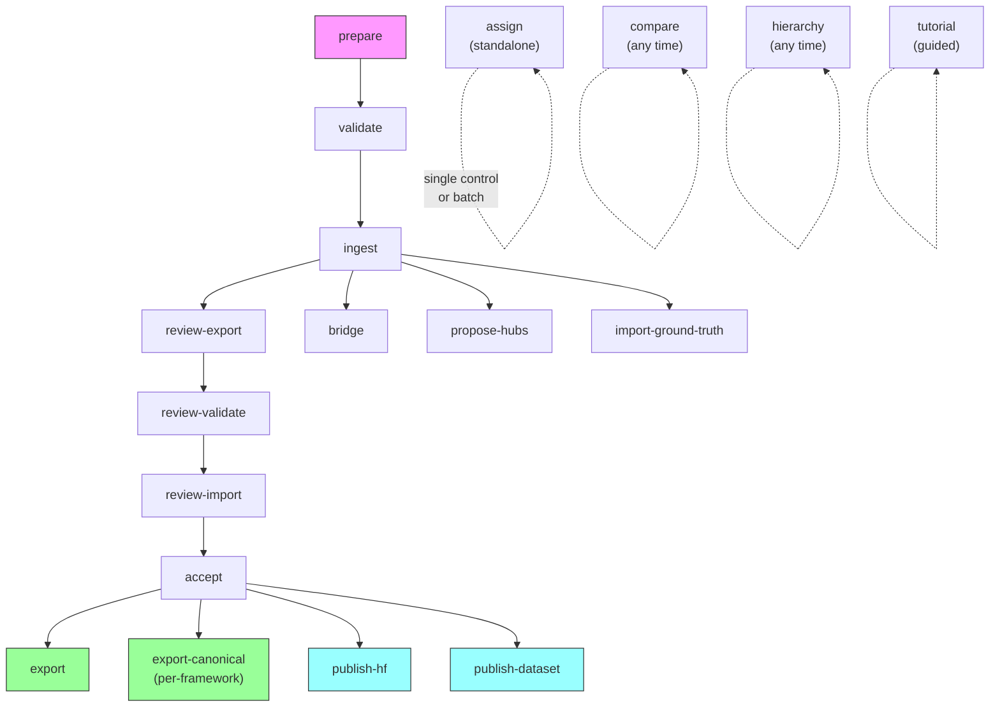

# TRACT CLI Reference

Complete reference for all 19 `tract` CLI subcommands.

**Installation:**

```bash
pip install -e "."            # Core (prepare, validate)
pip install -e ".[phase0]"    # Full ML stack (assign, ingest, compare, etc.)
pip install -e ".[llm]"       # LLM-assisted prepare (--llm flag)
pip install -e ".[dev]"       # Development tools (pytest, mypy)
```

## Command Flow



---

## Explore

### tutorial

Guided walkthrough of TRACT capabilities.

**Prerequisites:** Requires deployed model artifacts (Phase 1C pipeline output). Prints diagnostic if artifacts are missing.

```bash
tract tutorial
```

### hierarchy

Inspect a hub's position in the CRE hierarchy.

```bash
tract hierarchy --hub <hub-id> [--json]
```

| Option | Type | Default | Description |
|--------|------|---------|-------------|
| `--hub` | string | required | CRE hub ID to inspect |
| `--json` | flag | false | Output as JSON |

**Example:**
```bash
tract hierarchy --hub 646-285
```

### compare

Compare two frameworks via shared CRE hubs.

```bash
tract compare --framework <id> --framework <id> [--json]
```

| Option | Type | Default | Description |
|--------|------|---------|-------------|
| `--framework` | string | required (x2) | Framework IDs to compare |
| `--json` | flag | false | Output as JSON |

**Example:**
```bash
tract compare --framework mitre_atlas --framework owasp_ai_exchange
```

---

## Prepare

### prepare

Prepare a raw framework document for ingestion into TRACT.

```bash
tract prepare --file <path> --framework-id <id> --name <name> [options]
```

| Option | Type | Default | Description |
|--------|------|---------|-------------|
| `--file` | path | required | Input file (CSV, Markdown, JSON, PDF) |
| `--framework-id` | string | required | Framework ID slug (lowercase, underscores) |
| `--name` | string | required | Human-readable framework name |
| `--version` | string | "1.0" | Framework version |
| `--source-url` | string | "" | Official framework URL |
| `--mapping-unit` | string | "control" | What each entry represents |
| `--fetched-date` | string | today | Fetch date (YYYY-MM-DD) |
| `--expected-count` | int | none | Expected control count (warns on mismatch) |
| `--id-column` | string | auto | CSV column for control_id |
| `--title-column` | string | auto | CSV column for title |
| `--description-column` | string | auto | CSV column for description |
| `--fulltext-column` | string | auto | CSV column for full_text |
| `--llm` | flag | false | Use Claude API for extraction (requires `ANTHROPIC_API_KEY`) |
| `--format` | choice | auto | Override format detection: csv, markdown, json, unstructured |
| `--output` | path | auto | Output file path |
| `--heading-level` | int | auto | Markdown heading depth to split on |
| `--json` | flag | false | Output summary as JSON |

**Examples:**
```bash
# CSV with auto-detected columns
tract prepare --file controls.csv --framework-id new_fw --name "New Framework"

# PDF with LLM extraction
tract prepare --file document.pdf --llm --framework-id new_fw \
  --name "New Framework" --version "1.0" --source-url "https://example.com"

# Markdown with explicit heading level
tract prepare --file controls.md --framework-id new_fw --name "New Framework" \
  --heading-level 2
```

### validate

Validate a prepared framework JSON file.

```bash
tract validate --file <path> [--json]
```

| Option | Type | Default | Description |
|--------|------|---------|-------------|
| `--file` | path | required | Framework JSON file to validate |
| `--json` | flag | false | Machine-readable output |

**Examples:**
```bash
tract validate --file prepared.json
tract validate --file prepared.json --json
```

---

## Assign

### assign

Assign control text to CRE hubs using the trained model.

**Prerequisites:** Requires deployed model artifacts.

```bash
tract assign [text] [options]
```

| Option | Type | Default | Description |
|--------|------|---------|-------------|
| `text` | positional | stdin | Control text to assign |
| `--file` | path | none | Newline-delimited text file (batch mode) |
| `--top-k` | int | 5 | Number of top hub assignments |
| `--output` | path | auto | Output path for batch mode |
| `--raw` | flag | false | Show raw cosine similarity instead of calibrated confidence |
| `--verbose` | flag | false | Show both metrics, conformal set, and OOD status |
| `--json` | flag | false | Output as JSON |

**Examples:**
```bash
# Single control
tract assign "Ensure AI models are tested for bias"

# Batch mode
tract assign --file controls.txt --output results.jsonl

# Verbose with raw scores
tract assign "Access control policy" --raw --verbose --top-k 10
```

### ingest

Ingest a validated framework and generate CRE hub assignments for review.

**Prerequisites:** Requires deployed model artifacts.

```bash
tract ingest --file <path> [--force] [--json]
```

| Option | Type | Default | Description |
|--------|------|---------|-------------|
| `--file` | path | required | Framework JSON file (FrameworkOutput schema) |
| `--force` | flag | false | Overwrite if framework ID already exists |
| `--json` | flag | false | Output as JSON |

**Example:**
```bash
tract ingest --file new_framework.json
```

### accept

Commit reviewed assignments to the crosswalk database.

```bash
tract accept --review <path> [--force] [--json]
```

| Option | Type | Default | Description |
|--------|------|---------|-------------|
| `--review` | path | required | Reviewed JSON file from `tract ingest` |
| `--force` | flag | false | Replace if framework already exists in DB |
| `--json` | flag | false | Output summary as JSON |

**Examples:**
```bash
tract accept --review new_framework_review.json
tract accept --review new_framework_review.json --force
```

---

## Review

### review-export

Generate review JSON for expert review of model predictions.

```bash
tract review-export [--output <dir>] [--model-dir <path>]
```

| Option | Type | Default | Description |
|--------|------|---------|-------------|
| `--output` | path | results/review | Output directory for review files |
| `--model-dir` | path | auto | Path to deployment model directory |

**Example:**
```bash
tract review-export --output results/review
```

### review-validate

Validate a reviewed predictions JSON file.

```bash
tract review-validate --input <path>
```

| Option | Type | Default | Description |
|--------|------|---------|-------------|
| `--input` | path | required | Path to reviewed JSON file |

**Example:**
```bash
tract review-validate --input results/review/review_export.json
```

### review-import

Import expert review decisions into the crosswalk database.

```bash
tract review-import --input <path> --reviewer <name>
```

| Option | Type | Default | Description |
|--------|------|---------|-------------|
| `--input` | path | required | Path to reviewed JSON file |
| `--reviewer` | string | required | Reviewer name/identifier |

**Example:**
```bash
tract review-import --input review.json --reviewer expert_1
```

### review-proposals

Interactive review of hub proposals.

```bash
tract review-proposals --round <n> [--dry-run]
```

| Option | Type | Default | Description |
|--------|------|---------|-------------|
| `--round` | int | required | Proposal round number |
| `--dry-run` | flag | false | Show proposals without modifying anything |

**Example:**
```bash
tract review-proposals --round 1 --dry-run
```

---

## Analyze

### bridge

Discover AI↔traditional CRE hub connections through embedding similarity.

```bash
tract bridge [options]
```

| Option | Type | Default | Description |
|--------|------|---------|-------------|
| `--output-dir` | path | results/bridge | Output directory |
| `--top-k` | int | 3 | Top-K traditional matches per AI hub |
| `--skip-descriptions` | flag | false | Skip LLM-generated bridge descriptions |
| `--commit` | flag | false | Commit reviewed candidates to hierarchy |
| `--candidates` | path | none | Path to reviewed bridge_candidates.json (for --commit) |

**Examples:**
```bash
# Generate bridge candidates
tract bridge --skip-descriptions

# Commit reviewed bridges
tract bridge --commit --candidates results/bridge/bridge_candidates.json
```

### propose-hubs

Generate new CRE hub proposals from out-of-distribution controls.

```bash
tract propose-hubs [--name-with-llm] [--budget <n>] [--json]
```

| Option | Type | Default | Description |
|--------|------|---------|-------------|
| `--name-with-llm` | flag | false | Use Claude API to generate hub names |
| `--budget` | int | 40 | Max proposals to generate |
| `--json` | flag | false | Output as JSON |

**Example:**
```bash
tract propose-hubs --name-with-llm --budget 20
```

### import-ground-truth

Import OpenCRE ground truth links and run inference on uncovered frameworks.

```bash
tract import-ground-truth [--dry-run]
```

| Option | Type | Default | Description |
|--------|------|---------|-------------|
| `--dry-run` | flag | false | Report counts without modifying DB |

**Example:**
```bash
tract import-ground-truth --dry-run
```

---

## Export

### export

Export crosswalk assignments in various formats.

```bash
tract export [options]
```

| Option | Type | Default | Description |
|--------|------|---------|-------------|
| `--format` | choice | csv | Output format: csv, json, jsonl |
| `--framework` | string | all | Filter to single framework |
| `--hub` | string | all | Filter to single hub |
| `--min-confidence` | float | none | Minimum confidence threshold |
| `--status` | string | all | Filter by review status |
| `--output` | path | stdout | Output file path |
| `--opencre` | flag | false | Export in OpenCRE CSV format (one CSV per framework) |
| `--opencre-proposals` | flag | false | Export hub proposals document for OpenCRE |
| `--output-dir` | path | ./opencre_export/ | Output directory for OpenCRE export |
| `--dry-run` | flag | false | Show what would be exported without writing |
| `--skip-staleness` | flag | false | Skip pre-export staleness check |

**Examples:**
```bash
# CSV for a specific framework
tract export --format csv --framework mitre_atlas

# High-confidence assignments only
tract export --format jsonl --min-confidence 0.8 --output confident.jsonl

# OpenCRE import format
tract export --opencre --output-dir ./opencre_export/
```

### export-canonical

Export per-framework canonical JSON snapshots for OpenCRE's incremental import RFC.

**Prerequisites:** Requires crosswalk.db with accepted assignments and deployment model artifacts.

```bash
tract export-canonical [options]
```

| Option | Type | Default | Description |
|--------|------|---------|-------------|
| `--framework` | string | all | Filter to a single framework ID |
| `--output-dir` | path | canonical_export/ | Output directory |
| `--with-embeddings` | flag | false | Include per-framework .npz embedding files |
| `--dry-run` | flag | false | Show what would be exported without writing files |

**Output structure:**
```
canonical_export/
├── csa_aicm/
│   ├── snapshot.json      # StandardSnapshot with controls + mappings
│   ├── changeset.json     # Diff against prior export
│   └── embeddings.npz     # (optional) per-framework embeddings
├── mitre_atlas/
│   ├── snapshot.json
│   └── changeset.json
└── ...
```

**Examples:**
```bash
# Preview without writing files
tract export-canonical --dry-run

# Export a single framework
tract export-canonical --framework csa_aicm

# Export all frameworks with embeddings
tract export-canonical --with-embeddings

# Export to a custom directory
tract export-canonical --output-dir ./my_export/
```

---

## Publish

### publish-hf

Publish the trained model to HuggingFace Hub.

**Prerequisites:** Requires HuggingFace authentication (credential manager or `HF_TOKEN` environment variable).

```bash
tract publish-hf --repo-id <repo-id> [options]
```

| Option | Type | Default | Description |
|--------|------|---------|-------------|
| `--repo-id` | string | required | HuggingFace repo ID |
| `--staging-dir` | path | build/hf_repo | Local build directory |
| `--dry-run` | flag | false | Build and scan, no upload |
| `--skip-upload` | flag | false | Build and scan only |
| `--gpu-hours` | float | none | GPU training hours for model card |

**Examples:**
```bash
# Dry run (build + scan, no upload)
tract publish-hf --repo-id <your-repo-id> --dry-run

# Full publish
tract publish-hf --repo-id <your-repo-id> --gpu-hours <hours>
```

### publish-dataset

Publish the crosswalk dataset to HuggingFace Datasets.

**Prerequisites:** Requires HuggingFace authentication (credential manager or `HF_TOKEN` environment variable).

```bash
tract publish-dataset [options]
```

| Option | Type | Default | Description |
|--------|------|---------|-------------|
| `--repo-id` | string | auto | HuggingFace repo ID |
| `--staging-dir` | path | build/dataset | Local build directory |
| `--dry-run` | flag | false | Build without upload |
| `--skip-upload` | flag | false | Build only, no upload |

**Examples:**
```bash
# Dry run
tract publish-dataset --dry-run

# Full publish
tract publish-dataset
```

---

## Common Workflows

#### Add a new framework from PDF

```bash
# 1. Prepare (extract controls using LLM)
tract prepare --file framework.pdf --llm \
  --framework-id new_fw --name "New Framework" --version "1.0"

# 2. Validate the output
tract validate --file new_fw_prepared.json

# 3. Ingest (generates assignments + review file)
tract ingest --file new_fw_prepared.json

# 4. Review the assignments (edit the review JSON manually)
# 5. Accept reviewed assignments
tract accept --review new_fw_review.json

# 6. Export
tract export --framework new_fw --format csv
```

#### Compare two frameworks

```bash
tract compare --framework mitre_atlas --framework nist_800_53
```

#### Export for OpenCRE integration

```bash
tract export --opencre --output-dir ./opencre_export/ --dry-run
tract export --opencre --output-dir ./opencre_export/
```

#### Export canonical snapshots for OpenCRE RFC

```bash
# Initial export (all frameworks, creates snapshot + changeset per framework)
tract export-canonical

# Subsequent export (changeset shows what changed since last export)
tract export-canonical --framework csa_aicm

# Include embeddings for downstream consumers
tract export-canonical --with-embeddings
```

See the [Framework Guide](framework-guide.md) for detailed walkthroughs and the [Glossary](glossary.md) for term definitions.
