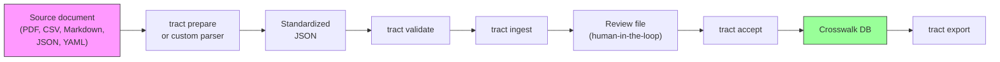

# Adding a Framework to TRACT

This guide walks you through adding a new security framework to the TRACT crosswalk — from a raw document to CRE hub assignments linked to every other framework in the database.

## Overview

When you add a framework, its controls are:
1. **Standardized** into TRACT's JSON schema (control ID, title, description)
2. **Validated** for schema conformance and data quality
3. **Assigned** to CRE hubs by the trained model (with calibrated confidence scores)
4. **Reviewed** by a human expert (accept, reassign, or reject each assignment)
5. **Committed** to the crosswalk database
6. **Exportable** — your framework is now crosswalked with all 31 existing frameworks



There are two paths to Step 1 — choose based on your framework's source format.

## Path 1: LLM-Assisted Preparation (Most Frameworks)

For frameworks distributed as PDF, Markdown, CSV, or other unstructured/semi-structured formats.

**Prerequisites:**
- `ANTHROPIC_API_KEY` environment variable set (required for `--llm` mode, which calls Claude Sonnet for control extraction)
- `pip install -e ".[llm]"` for LLM dependencies

**Basic usage:**

```bash
tract prepare \
  --file my_framework.pdf \
  --framework-id my_fw \
  --name "My Security Framework" \
  --version "1.0" \
  --source-url "https://example.com/framework" \
  --mapping-unit control
```

**CSV with auto-detected columns:**

```bash
tract prepare \
  --file controls.csv \
  --framework-id my_fw \
  --name "My Framework"
```

TRACT auto-detects columns named `control_id`, `title`, `description`. Override with `--id-column`, `--title-column`, `--description-column` if your columns have different names.

**LLM-assisted extraction (for unstructured PDFs):**

```bash
tract prepare \
  --file dense_document.pdf \
  --llm \
  --framework-id my_fw \
  --name "My Framework" \
  --version "1.0"
```

The `--llm` flag invokes Claude Sonnet to chunk the document and extract structured controls. This handles documents where controls aren't cleanly separated by headings or tables.

**Output:** A JSON file matching TRACT's `FrameworkOutput` schema:

```json
{
  "framework_id": "my_fw",
  "framework_name": "My Security Framework",
  "version": "1.0",
  "source_url": "https://example.com/framework",
  "fetched_date": "2026-05-04",
  "mapping_unit_level": "control",
  "controls": [
    {
      "control_id": "MW-1",
      "title": "Access Control Policy",
      "description": "The organization shall establish...",
      "hierarchy_level": "control"
    }
  ]
}
```

**Common issues:**
- PDFs with complex tables may need `--llm` mode for reliable extraction
- Frameworks without explicit control IDs: TRACT generates positional IDs (e.g., `CTRL-001`)
- Very large documents: `tract prepare` chunks automatically (100K token limit per chunk)

See `examples/` for [sample CSV and Markdown files](../examples/README.md).

## Path 2: Writing a Custom Parser (Structured Sources)

For frameworks distributed as JSON, YAML, or well-structured HTML — where programmatic extraction is more reliable than LLM-assisted.

All TRACT parsers subclass `BaseParser` (defined in `tract/parsers/base.py`). The base class handles sanitization, validation, count-checking, and atomic output writing. You implement one method: `parse()`.

**Anatomy of a parser** (using CoSAI as an example — 55 controls from YAML):

```python
"""Parser for CoSAI Risk Map — Tier 2 YAML."""
from __future__ import annotations
import logging
import yaml
from tract.parsers.base import BaseParser
from tract.schema import Control

logger = logging.getLogger(__name__)

class CosaiParser(BaseParser):
    # Required class attributes
    framework_id = "cosai"
    framework_name = "CoSAI Landscape of AI Security Risk Map"
    version = "1.0"
    source_url = "https://cosai.dev"
    mapping_unit_level = "control"
    expected_count = 55

    def parse(self) -> list[Control]:
        controls: list[Control] = []
        with open(self.raw_dir / "controls.yaml", encoding="utf-8") as f:
            data = yaml.safe_load(f)
        for ctrl in data.get("controls", []):
            controls.append(Control(
                control_id=ctrl["id"],
                title=ctrl["title"],
                description=ctrl.get("description", ""),
                hierarchy_level="control",
            ))
        return controls

if __name__ == "__main__":
    parser = CosaiParser()
    parser.run()
```

**What `BaseParser.run()` does for you:**
1. Calls your `parse()` to get raw controls
2. Sanitizes all text fields (strips null bytes, normalizes Unicode NFC, enforces 2000-char description limit)
3. Checks parsed count against `expected_count` (warns on >10% deviation)
4. Builds a `FrameworkOutput` Pydantic model
5. Writes to `data/processed/frameworks/<framework_id>.json` atomically (write to temp file, then rename)

**Testing pattern:**

```python
# tests/test_parse_my_framework.py
from pathlib import Path
from tract.parsers.base import BaseParser

def test_my_parser_produces_valid_output(tmp_path):
    # Create a small fixture
    fixture = tmp_path / "controls.json"
    fixture.write_text('{"controls": [{"id": "T-1", "title": "Test", "desc": "A test control"}]}')

    parser = MyParser(raw_dir=tmp_path, output_dir=tmp_path)
    output = parser.run()

    assert output.framework_id == "my_fw"
    assert len(output.controls) == 1
    assert output.controls[0].control_id == "T-1"
```

**Directory conventions:**
- Parser file: `parsers/parse_<framework_id>.py`
- Raw data: `data/raw/frameworks/<framework_id>/`
- Test: `tests/test_parse_<framework_id>.py`
- Test fixture: `tests/fixtures/<framework_id>/`

## Validation

After preparation (either path), validate the output:

```bash
tract validate --file my_fw_prepared.json
```

Validation checks:
- **Schema conformance** — required fields, correct types, valid framework_id format (`^[a-z][a-z0-9_]{1,49}$`)
- **Control IDs** — unique within the framework, non-empty
- **Descriptions** — minimum 10 characters, warns below 50, enforces 2000-char max
- **Duplicate detection** — flags controls with identical descriptions
- **Adversarial rules** — warns if title and description are redundant, flags non-English text

Warnings are advisory; errors block ingestion. Use `--json` for machine-readable output.

## Ingestion

Once validated, ingest the framework into the crosswalk:

```bash
tract ingest --file my_fw_prepared.json
```

**What happens:**
1. Controls are embedded by the deployed bi-encoder model
2. Each control is matched against all 400 CRE hub embeddings by cosine similarity
3. Top-k hub assignments are generated with calibrated confidence scores
4. A **review file** is written (JSON) containing each control's proposed assignment

**Note:** Ingestion requires the deployed model artifacts from the Phase 1C pipeline. See [Architecture](architecture.md) for model details.

## Review & Accept

The review file is the human-in-the-loop checkpoint. For each control, it shows:

```json
{
  "control_id": "MW-1",
  "control_text": "The organization shall establish access control policies...",
  "proposed_hub": "646-285",
  "proposed_hub_name": "Access control",
  "confidence": 0.847,
  "alternatives": [
    {"hub": "862-167", "name": "Authorization", "confidence": 0.721},
    {"hub": "838-410", "name": "Authentication", "confidence": 0.654}
  ]
}
```

Review decisions: **accept** (correct), **reassign** (pick a different hub from alternatives or specify manually), or **reject** (no appropriate hub exists).

After review, commit to the crosswalk:

```bash
tract accept --review my_fw_review.json
```

## Verification

After ingestion, verify your framework landed correctly:

```bash
# See all assignments for your framework
tract export --framework my_fw

# See which CRE hubs your framework shares with MITRE ATLAS
tract compare --framework my_fw --framework mitre_atlas

# Inspect a specific hub's position in the hierarchy
tract hierarchy --hub 646-285
```

## Tips & Gotchas

- **Framework ID format:** lowercase letters, digits, and underscores only. Must start with a letter. Max 50 characters. Regex: `^[a-z][a-z0-9_]{1,49}$`
- **Description quality matters more than quantity.** A clear 100-word description produces better assignments than a vague 500-word one.
- **The 2000-character cap** on descriptions is enforced during sanitization. Longer text is preserved in the `full_text` field.
- **Sanitization strips:** null bytes, HTML tags, zero-width characters. Unicode is normalized to NFC form.
- **`--force` flag** on `tract ingest` and `tract accept` overwrites existing framework data. Use with care.

See the [CLI Reference](cli-reference.md) for full option details on each command, and the [Glossary](glossary.md) for term definitions.
