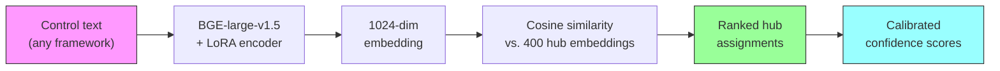
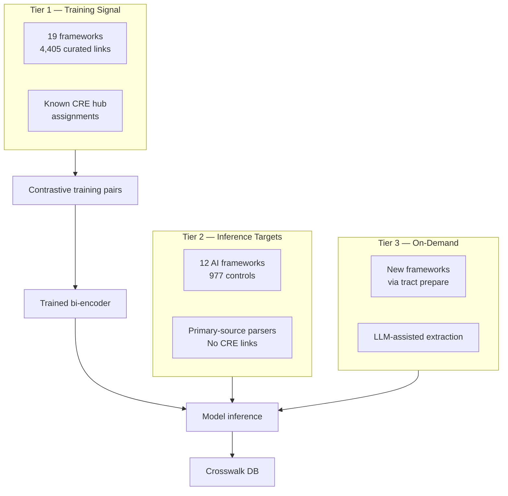
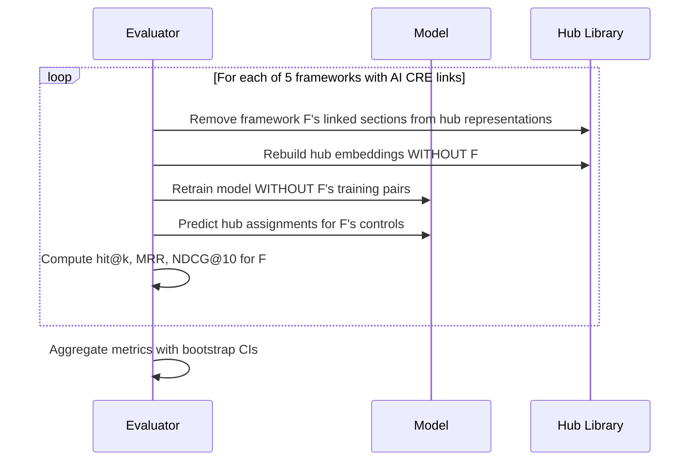
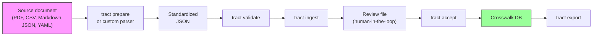
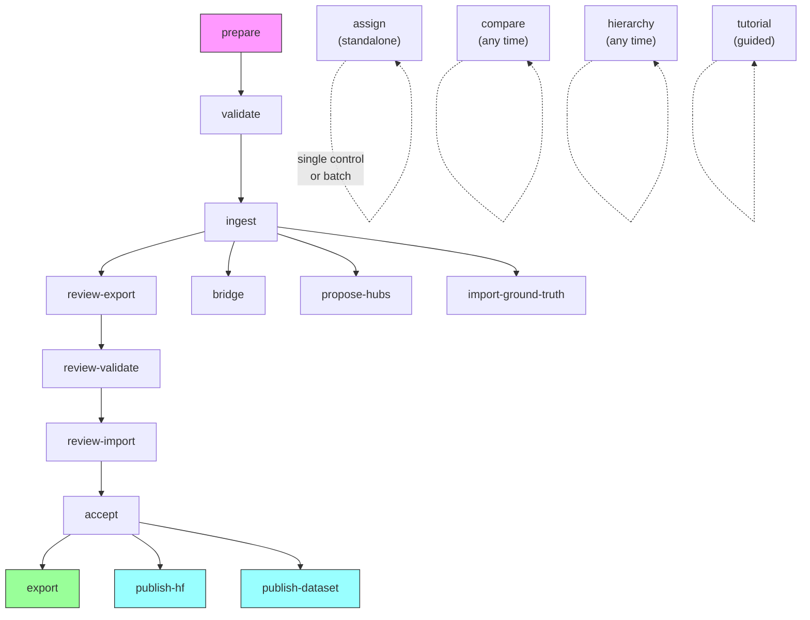
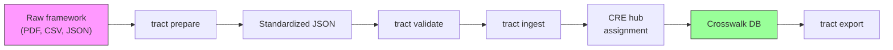
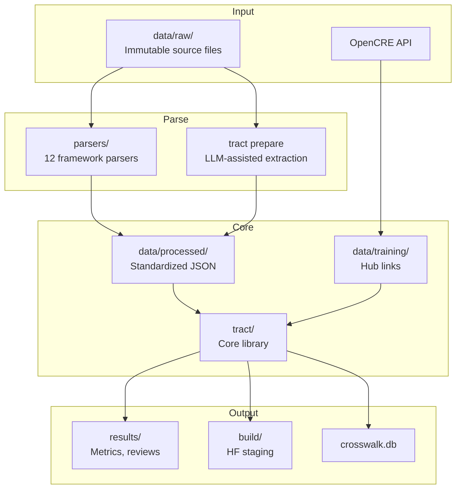

# TRACT Documentation Suite Implementation Plan

> **For agentic workers:** REQUIRED SUB-SKILL: Use superpowers:subagent-driven-development (recommended) or superpowers:executing-plans to implement this plan task-by-task. Steps use checkbox (`- [ ]`) syntax for tracking.

**Goal:** Create 7 documentation files (5 new, 2 updated) that take readers from "what is this?" to expert usage across three audiences: security practitioners, ML researchers, and open-source contributors.

**Architecture:** Hub-and-spokes model. README.md is the front door linking to 5 deep-dive docs. Each doc is self-contained with cross-references. Mermaid diagrams for visual concepts. All content derived from actual codebase state and results files — no fabricated metrics.

**Tech Stack:** Markdown, Mermaid diagrams (GitHub-native rendering), no code changes.

**Constraints:**
- DO NOT touch: any `.py` file, `CLAUDE.md`, `pyproject.toml`, `tract_experimental_narrative.ipynb`
- Parallel session is working on feature code — our files are documentation only
- Canonical GitHub URL: `https://github.com/rocklambros/TRACT` (not rockcyber)
- Content sanitization: never reproduce `pass` credential paths, `/home/rock/` paths, RunPod references, or email addresses from CLAUDE.md
- All metrics must be verified against actual results files (see Volatile Values in spec)

**Verified metrics (from adversarial review):**
- hit@1 = 0.537 [0.463, 0.612] (source: `results/phase1b/phase1b_textaware/corrected_metrics.json`)
- Zero-shot firewalled baseline hit@1 = 0.399 [0.324, 0.473]
- Delta = +0.139
- 5,238 assignments (4,331 opencre_ground_truth + 528 active_learning + 320 model_prediction + 59 ground_truth_T1-AI)
- 46/63 bridges accepted
- 31 frameworks, 2,802 controls
- 871 tests (verify at implementation time)
- 18 CLI subcommands

---

### Task 1: Create docs/glossary.md

**Files:**
- Create: `docs/glossary.md`

This is the foundation — other docs link here for term definitions.

- [ ] **Step 1: Create the glossary file**

Write the complete file:

```markdown
# TRACT Glossary

Cross-domain reference for terms used throughout TRACT documentation. Security practitioners will find ML concepts explained; ML researchers will find security framework terminology clarified.

---

**Assignment paradigm** — TRACT's core design principle: map each control independently to a CRE hub position via `g(control_text) → CRE_hub`. Never compare two controls pairwise. This scales linearly with the number of controls, unlike pairwise comparison which scales quadratically.

**Bi-encoder** — A neural network architecture that encodes two inputs (here: a control text and a CRE hub representation) independently into fixed-size vectors, then compares them via cosine similarity. TRACT uses BGE-large-v1.5 as its bi-encoder backbone. Contrast with *cross-encoder*, which processes both inputs jointly (more accurate but much slower).

**Bootstrap CI** — A confidence interval computed by resampling the evaluation data with replacement (typically 10,000 times) and computing the metric on each resample. TRACT reports 95% bootstrap confidence intervals for all evaluation metrics. Example: "hit@1 = 0.537 [0.463, 0.612]" means the true hit@1 is between 0.463 and 0.612 with 95% confidence.

**Bridge** — A discovered connection between an AI-specific CRE hub and a traditional security CRE hub, established when their embeddings are highly similar. Bridges reveal that an AI security concern (e.g., a MITRE ATLAS technique) maps to the same underlying security concept as a traditional control (e.g., a NIST 800-53 control). TRACT discovered 46 bridges from 63 candidates.

**Calibration** — The process of converting raw model outputs (cosine similarities) into meaningful probability estimates. TRACT uses temperature scaling (a form of Platt scaling) so that a reported confidence of 0.8 means the model is correct ~80% of the time. See also: *ECE*.

**Conformal prediction** — A statistical method that produces prediction *sets* with guaranteed coverage. If configured for 90% coverage, the prediction set will contain the correct CRE hub at least 90% of the time, regardless of the underlying model's accuracy. The trade-off is that prediction sets may contain multiple candidates.

**Contrastive fine-tuning** — A training approach where the model learns to place related items closer together and unrelated items farther apart in embedding space. TRACT trains with (control, correct_hub) positive pairs and hard negative hubs — hubs that are similar but incorrect — to sharpen the model's discrimination.

**Control** — A single security requirement, technique, weakness, or practice within a framework. Examples: NIST 800-53 control "AC-1 Access Control Policy", MITRE ATLAS technique "AML.T0043 Adversarial ML Attack", CWE weakness "CWE-79 Cross-site Scripting." TRACT's atomic unit of analysis.

**Cosine similarity** — A measure of similarity between two vectors, ranging from -1 (opposite) to +1 (identical direction). TRACT uses cosine similarity between control embeddings and hub embeddings to rank assignment candidates. Raw cosine scores are not probabilities — see *calibration*.

**CRE hub** — A node in the OpenCRE hierarchy that represents a specific security concept. Each hub has an ID (e.g., "646-285"), a name (e.g., "Input validation"), and links to controls in various frameworks. TRACT's label space consists of 400 leaf hubs. See also: *OpenCRE*.

**Crosswalk** — A mapping between controls in different security frameworks that address the same underlying concept. Traditional crosswalks are manually curated; TRACT generates crosswalks automatically by assigning controls from different frameworks to the same CRE hubs.

**ECE (Expected Calibration Error)** — A metric measuring how well a model's confidence scores match its actual accuracy. An ECE of 0.05 means the model's stated confidences are off by 5 percentage points on average. Lower is better. TRACT targets ECE < 0.10.

**Embedding** — A fixed-size numerical vector (1,024 dimensions for TRACT's BGE-large-v1.5) that captures the semantic meaning of a text. Similar texts produce similar embeddings. TRACT embeds both control texts and hub representations, then matches them by cosine similarity.

**Framework** — A published collection of security controls, requirements, or practices. Examples: NIST 800-53, MITRE ATLAS, OWASP Top 10 for LLM Applications. TRACT processes 31 frameworks spanning AI-specific and traditional security domains.

**Hard negative** — During training, a CRE hub that is semantically similar to the correct hub but is actually incorrect for a given control. Training with hard negatives (rather than random negatives) forces the model to make fine-grained distinctions. TRACT samples 3 hard negatives per positive pair using temperature-scaled similarity.

**hit@k** — The fraction of controls for which the correct CRE hub appears in the model's top-k predictions. hit@1 measures exact accuracy; hit@5 measures whether the correct hub is among the top 5 candidates. TRACT's trained model achieves hit@1 = 0.537 and the zero-shot baseline achieves hit@1 = 0.399.

**Hub description** — An LLM-generated natural language description of what a CRE hub covers, used to enrich the hub's embedding. Generated by Claude Opus with zero temperature for determinism. Combined with the hub's hierarchy path to form the hub representation.

**Hub firewall** — TRACT's evaluation integrity mechanism. When evaluating on framework X, all of X's linked sections are removed from CRE hub representations before computing embeddings. This prevents information leakage — the model cannot "cheat" by recognizing text it was trained on. Non-negotiable for honest evaluation.

**Hub hierarchy path** — The path from the root of the OpenCRE hierarchy to a specific hub, expressed as a text string. Example: "Technical controls > Input validation > SQL injection prevention". Concatenated with hub descriptions to form hub representations. Adding hierarchy paths improved zero-shot hit@1 by +7.6%.

**Hub proposal** — A suggested new CRE hub for controls that don't map well to any existing hub (out-of-distribution controls). Generated by clustering OOD control embeddings using HDBSCAN and naming clusters via LLM.

**LOFO (Leave-One-Framework-Out)** — TRACT's cross-validation strategy. For each framework with known CRE links, the model is retrained and hub representations are rebuilt *without* that framework, then evaluated on it. This is stricter than random holdout because it tests generalization to entirely unseen frameworks. See also: *hub firewall*.

**LoRA (Low-Rank Adaptation)** — A parameter-efficient fine-tuning technique that adds small trainable matrices to a frozen pretrained model. TRACT uses LoRA with rank 16 and alpha 32 on the query, key, and value attention layers of BGE-large-v1.5, training ~0.3% of total parameters.

**Mapping unit** — The atomic element within a framework that TRACT processes. Usually a "control" but may be a "technique" (MITRE ATLAS), "weakness" (CWE), "attack pattern" (CAPEC), or "article" (EU AI Act), depending on the framework's structure.

**MRR (Mean Reciprocal Rank)** — The average of 1/rank for each control's correct CRE hub in the ranked prediction list. If the correct hub is ranked 1st, the reciprocal rank is 1.0; if ranked 3rd, it's 0.333. Higher is better. Sensitive to the position of the first correct answer.

**NDCG@10 (Normalized Discounted Cumulative Gain)** — A ranking quality metric that rewards correct answers appearing higher in the list, with logarithmic discounting for lower positions. Ranges from 0 to 1. TRACT reports NDCG@10 as a complement to hit@k and MRR.

**OOD (Out-of-Distribution) detection** — Identifying controls whose embeddings are far from any known CRE hub, suggesting the control covers a concept not yet represented in the OpenCRE hierarchy. TRACT uses the 5th percentile of in-distribution similarity scores as the OOD threshold.

**OpenCRE (Open Common Requirement Enumeration)** — A community-maintained taxonomy that organizes security requirements into a hierarchy of groups and hubs, with links to controls in major frameworks. TRACT uses OpenCRE as its universal coordinate system — every control is positioned by its assignment to a CRE hub. See [opencre.org](https://opencre.org).

**Provenance** — The origin of a control-to-hub assignment in the crosswalk dataset. TRACT tracks four types: `opencre_ground_truth` (existing OpenCRE links), `ground_truth_T1-AI` (AI framework ground truth), `active_learning_round_2` (model predictions reviewed by experts), and `model_prediction` (accepted model output).

**Temperature scaling** — A post-hoc calibration method that divides model logits by a learned temperature parameter T before applying softmax. T > 1 makes the model less confident (spreading probability mass); T < 1 makes it more confident. TRACT learns T on a held-out calibration set to minimize ECE.

**Tier** — TRACT classifies frameworks into three tiers based on their relationship to OpenCRE:
- **Tier 1:** Frameworks already linked to OpenCRE (19 frameworks, 4,405 curated links) — used as training signal.
- **Tier 2:** AI frameworks with primary-source parsers but no CRE links (12 frameworks) — inference targets.
- **Tier 3:** New frameworks added via `tract prepare` — processed on demand.
```

- [ ] **Step 2: Verify the file renders correctly**

Run: `wc -l docs/glossary.md` — should be ~140-160 lines.
Check: all term entries are in alphabetical order.
Check: no references to `pass`, `/home/rock/`, RunPod, or email addresses.

- [ ] **Step 3: Commit**

```bash
git add docs/glossary.md
git commit -m "docs: add cross-domain glossary with 30 terms bridging security and ML"
```

---

### Task 2: Create docs/architecture.md

**Files:**
- Create: `docs/architecture.md`

The deepest technical document. Contains Mermaid diagrams, metrics tables, and practitioner bridge sections.

- [ ] **Step 1: Create the architecture file**

Write the complete file:

```markdown
# TRACT Architecture

How TRACT assigns security framework controls to OpenCRE hubs using contrastive fine-tuning.

> **Reading guide:** This document covers the full technical approach. If you're a security practitioner, look for the **"For practitioners"** callouts — they translate ML concepts into security implications. If you're an ML researcher, the methodology sections (3–7) are where the interesting decisions live.

## 1. The Assignment Paradigm

TRACT's core principle: every control is mapped *independently* to a position in the OpenCRE hierarchy.

```
g(control_text) → CRE_hub_position
```

This is deliberately **not** pairwise comparison (`f(control_A, control_B) → similarity`). Pairwise comparison scales as O(n²) — with 2,802 controls across 31 frameworks, that's ~3.9 million comparisons. Assignment scales as O(n) — each control is embedded once and matched against the hub library.

The crosswalk emerges transitively: if Control A from NIST 800-53 and Control B from MITRE ATLAS both assign to CRE hub "646-285 Input Validation", they are crosswalked through that shared hub.



> **For practitioners:** If you've built crosswalks manually, you know the pain of comparing every control against every other. TRACT sidesteps this entirely — each control gets a "coordinate" in the CRE hierarchy, and crosswalks fall out automatically from shared coordinates.

## 2. The OpenCRE Hierarchy

[OpenCRE](https://opencre.org) (Open Common Requirement Enumeration) is a community-maintained taxonomy that organizes security requirements into a tree of groups and hubs.

**Structure:**
- **5 root branches:** Cross-cutting concerns, Governance, Development, Technical controls, Operations
- **122 internal groups** that organize related concepts
- **400 leaf hubs** — the label space for TRACT's assignments
- **522 total nodes** across 5 depth levels

Each hub links to controls in established frameworks (NIST 800-53, OWASP ASVS, CWE, etc.) through two link types:
- **LinkedTo** — human-curated expert links
- **AutomaticallyLinkedTo** — deterministic transitive chains (e.g., CAPEC attack pattern → CWE weakness → CRE hub). These are *not* ML output — they follow published taxonomic relationships and are treated as equivalent to expert links.

> **For ML researchers:** The 400 leaf hubs form a multi-class classification target, but unlike typical classification, the labels have rich hierarchical structure and textual descriptions. This structure is exploited in the hub representation (see Section 5).

## 3. Data Landscape

TRACT processes frameworks in three tiers based on their relationship to OpenCRE:



| Tier | Frameworks | Controls | Role |
|------|-----------|----------|------|
| 1 | 19 (NIST 800-53, CWE, ASVS, CAPEC, ...) | 1,825 | Training signal — known CRE links become positive pairs |
| 2 | 12 (CSA AICM, MITRE ATLAS, EU AI Act, ...) | 977 | Primary inference targets — AI security controls |
| 3 | User-supplied | Varies | New frameworks processed via `tract prepare` |

> **For practitioners:** Tier 1 frameworks are the "ground truth" that teaches the model what good assignments look like. Tier 2 frameworks are the AI security standards you care about — TRACT assigns them to CRE hubs automatically. Tier 3 is how you add your own framework.

## 4. Phase 0: Zero-Shot Baselines

Before training any model, TRACT established feasibility through two gates:

| Gate | Criterion | Result | Verdict |
|------|-----------|--------|---------|
| **A** | Opus hit@5 > 0.50 on all-198 AI controls | 0.722 [0.662, 0.783] | **PASS** |
| **B** | Opus hit@1 − best embedding hit@1 > 0.10 | 0.465 − 0.348 = 0.117 | **PASS** |

**Gate A** confirms the task is feasible — an LLM can find the right CRE hub in its top 5 more than 70% of the time. **Gate B** confirms there's room for a trained model to improve over off-the-shelf embeddings.

| Method | hit@1 | hit@5 | MRR | NDCG@10 |
|--------|-------|-------|-----|---------|
| BGE-large-v1.5 (baseline) | 0.348 [0.283, 0.414] | 0.621 [0.556, 0.687] | 0.468 [0.411, 0.526] | 0.525 [0.470, 0.580] |
| GTE-large-v1.5 | 0.338 [0.273, 0.404] | 0.586 [0.515, 0.652] | 0.449 [0.390, 0.508] | 0.501 [0.444, 0.558] |
| DeBERTa-v3-NLI | 0.000 [0.000, 0.000] | 0.010 [0.000, 0.025] | 0.004 [0.000, 0.008] | 0.004 [0.000, 0.011] |
| BGE + hierarchy paths | 0.424 [0.354, 0.495] | 0.667 [0.601, 0.732] | 0.528 [0.469, 0.587] | 0.581 [0.525, 0.637] |
| BGE + LLM descriptions | 0.357 [0.287, 0.433] | 0.592 [0.516, 0.669] | 0.464 [0.399, 0.529] | 0.516 [0.454, 0.580] |
| **Opus LLM probe** | **0.465 [0.394, 0.535]** | **0.722 [0.662, 0.783]** | **0.568 [0.508, 0.628]** | **0.618 [0.561, 0.674]** |

All confidence intervals are 95% bootstrap CIs (10,000 resamples). Full results in [Phase 0 Results](phase0-results.md) and [Experimental Narrative](../tract_experimental_narrative.ipynb) Section 3.

**Key findings:**
- **DeBERTa-v3-NLI fails completely** (hit@1 = 0.000). NLI-based cross-encoders and classification heads do not work for this task.
- **Hierarchy paths help** (+7.6% hit@1). Encoding the CRE tree path into hub representations gives the model structural context.
- **LLM descriptions hurt zero-shot** (+0.9% hit@1, within noise). Descriptions only help after fine-tuning.

> **For practitioners:** This phase proved that automatic CRE assignment is feasible but requires a dedicated model — you can't just use generic text similarity tools. The Opus LLM probe set the ceiling: a model that reads all 400 hub descriptions and reasons about each one can achieve ~47% exact accuracy.

## 5. Model Architecture & Training

**Base model:** [BAAI/bge-large-en-v1.5](https://huggingface.co/BAAI/bge-large-en-v1.5) — a 335M parameter bi-encoder producing 1,024-dimensional embeddings. Selected over GTE-large-v1.5 based on Phase 0 results.

**Fine-tuning:** LoRA (Low-Rank Adaptation) applied to query, key, and value attention layers:

| Hyperparameter | Value |
|---------------|-------|
| LoRA rank | 16 |
| LoRA alpha | 32 |
| LoRA dropout | 0.1 |
| Batch size | 32 |
| Learning rate | 5e-4 |
| Warmup ratio | 0.1 |
| Weight decay | 0.01 |
| Max epochs | 20 |
| Max sequence length | 512 |
| Hard negatives per positive | 3 |
| Negative sampling temperature | 2.0 |
| Random seed | 42 |

**Training signal:** Each known OpenCRE link becomes a (control_text, hub_representation) positive pair. Hub representations are the concatenation of the hierarchy path and an LLM-generated description. Hard negatives are sampled from the most similar *incorrect* hubs using temperature-scaled cosine similarity — this forces the model to distinguish between closely related security concepts.

**Experiment tracking:** All training runs logged to Weights & Biases with: data hash, hyperparameters, git SHA, seed, and full metric suite.

> **For practitioners:** LoRA means the model is efficient — it trains in minutes on a single GPU by adapting <1% of the base model's parameters. The hard negative sampling is critical: it teaches the model the difference between, say, "input validation" and "output encoding" — concepts that sound similar but map to different CRE hubs.

## 6. LOFO Evaluation

Leave-One-Framework-Out cross-validation ensures honest evaluation. For each framework with known CRE links:



The **hub firewall** is the critical integrity mechanism: when evaluating on framework F, all of F's linked sections are stripped from CRE hub representations *before* computing hub embeddings. Without this, a hub's representation could contain text from the very controls being evaluated — information leakage that would inflate metrics.

> **For practitioners:** Think of it like a blind taste test. When we test whether the model can assign MITRE ATLAS techniques to the right CRE hubs, we first remove all MITRE ATLAS information from those hubs. The model has to figure out the mapping from the security concepts alone, not from memorized associations. This is what makes TRACT's evaluation honest.

## 7. Key Results

**Trained model (LOFO, hub firewall, multi-label-aware):**

| Metric | Value | 95% CI |
|--------|-------|--------|
| **hit@1** | **0.537** | [0.463, 0.612] |

**Delta over zero-shot firewalled baseline:** +0.139 (baseline hit@1 = 0.399)

**Per-framework breakdown:**

| Framework | hit@1 | hit@5 | MRR | NDCG@10 |
|-----------|-------|-------|-----|---------|
| MITRE ATLAS | 0.279 | 0.605 | 0.411 | 0.480 |
| NIST AI 100-2 | 0.429 | 0.643 | 0.508 | 0.557 |
| OWASP AI Exchange | 0.762 | 0.937 | 0.824 | 0.852 |
| OWASP Top 10 for LLM | 0.333 | 0.667 | 0.489 | 0.570 |
| OWASP Top 10 for ML | 0.714 | 0.857 | 0.786 | 0.804 |

OWASP AI Exchange achieves the highest accuracy (76.2% hit@1) because its controls are well-scoped and closely aligned with existing CRE concepts. MITRE ATLAS is hardest (27.9%) because its techniques are fine-grained and often span multiple security concepts.

Gate 1 passed cleanly: all folds non-negative (every framework improved or held steady vs. zero-shot).

Full experiment details in the [Experimental Narrative](../tract_experimental_narrative.ipynb) Sections 5–8.

## 8. Calibration & Confidence

Raw cosine similarities are not probabilities. TRACT applies a calibration pipeline:

1. **Temperature scaling** — learns a single parameter T on a held-out calibration set (420 items). Divides cosine similarities by T before softmax to produce calibrated probabilities. Target: ECE < 0.10.
2. **Conformal prediction** — produces prediction sets with 90% coverage guarantee. The set size varies: easy controls get a set of 1; ambiguous controls may get 3–5 candidates.
3. **OOD detection** — flags controls whose maximum similarity to any hub falls below the 5th percentile of in-distribution scores. These controls may need a new CRE hub (see hub proposals).

> **For practitioners:** When TRACT says a control maps to a hub with 85% confidence, that number is calibrated — the model is correct ~85% of the time at that confidence level. If it says "uncertain," it also provides a set of candidates that's guaranteed to contain the right answer 90% of the time.

## 9. Bridge Analysis

TRACT discovers connections between AI-specific and traditional security CRE hubs by analyzing embedding similarity:

- **63 bridge candidates** identified (top-3 traditional matches per AI hub)
- **46 accepted** after expert review
- **17 rejected** (false similarities, usually due to overlapping terminology)

Bridges reveal that many AI security concerns map to the same underlying concepts as traditional security controls. For example, a MITRE ATLAS technique about model input manipulation may bridge to the same CRE hub as NIST 800-53's input validation control family — they address the same concern in different domains.

> **For practitioners:** Bridges are the "aha moment" — they show that your existing NIST 800-53 controls already partially address AI risks, and conversely, that AI-specific frameworks like ATLAS cover concerns your traditional controls miss. This is directly actionable for gap analysis.

## 10. Limitations & Future Work

**Current limitations:**
- **5 uncovered frameworks** (CSA AICM, EU AI Act, MITRE ATLAS, NIST AI 600-1, OWASP Agentic Top 10) have no ground-truth CRE links, so their assignments are model-only with no direct validation.
- **Granularity disagreements** — some frameworks define controls at a coarser level than CRE hubs. A single EU AI Act article may span 3–4 CRE hubs, but TRACT assigns it to one.
- **Single-label assignment** — each control maps to one hub. Multi-hub assignment (with calibrated weights) is a natural extension.
- **MITRE ATLAS difficulty** — 27.9% hit@1 reflects genuinely hard mapping, not model failure. Many ATLAS techniques are novel concepts that straddle multiple CRE categories.
- **Hub evolution** — the OpenCRE hierarchy changes over time. TRACT's hub proposals (generated by `tract propose-hubs`) suggest new hubs, but integrating them requires OpenCRE community review.

**Not limitations:**
- **AutomaticallyLinkedTo quality** — these deterministic transitive links (CAPEC → CWE → CRE) are expert-quality, not ML noise. Treating them as equivalent to human LinkedTo is correct.
- **Dataset size** — 4,405 training links across 22 frameworks is sufficient for the 400-hub label space, especially with hard negative mining and LoRA's parameter efficiency.
```

- [ ] **Step 2: Verify structure and metrics**

Run: `wc -l docs/architecture.md` — should be ~280-320 lines.
Check: hit@1 is 0.537 (not 0.531), delta is +0.139 (not +0.132).
Check: LOFO diagram uses `sequenceDiagram` with `loop` syntax.
Check: all "For practitioners" callouts present (sections 1, 2, 3, 4, 5, 6, 8, 9).
Check: no references to `pass`, `/home/rock/`, RunPod, or email addresses.

- [ ] **Step 3: Commit**

```bash
git add docs/architecture.md
git commit -m "docs: add architecture deep-dive with assignment paradigm, LOFO evaluation, and metrics"
```

---

### Task 3: Create docs/framework-guide.md

**Files:**
- Create: `docs/framework-guide.md`

End-to-end walkthrough for adding a new framework to the crosswalk.

- [ ] **Step 1: Create the framework guide**

Write the complete file:

```markdown
# Adding a Framework to TRACT

This guide walks you through adding a new security framework to the TRACT crosswalk — from a raw document to CRE hub assignments linked to every other framework in the database.

## Overview

When you add a framework, its controls are:
1. **Standardized** into TRACT's JSON schema (control ID, title, description)
2. **Validated** for schema conformance and data quality
3. **Assigned** to CRE hubs by the trained model (with calibrated confidence scores)
4. **Reviewed** by a human expert (accept, reassign, or reject each assignment)
5. **Committed** to the crosswalk database
6. **Exportable** — your framework is now crosswalked with all 31 existing frameworks



There are two paths to Step 1 — choose based on your framework's source format.

## Path 1: LLM-Assisted Preparation (Most Frameworks)

For frameworks distributed as PDF, Markdown, CSV, or other unstructured/semi-structured formats.

**Prerequisites:**
- `ANTHROPIC_API_KEY` environment variable set (required for `--llm` mode, which calls Claude Sonnet for control extraction)
- `pip install -e ".[llm]"` for LLM dependencies

**Basic usage:**

```bash
tract prepare \
  --file my_framework.pdf \
  --framework-id my_fw \
  --name "My Security Framework" \
  --version "1.0" \
  --source-url "https://example.com/framework" \
  --mapping-unit control
```

**CSV with auto-detected columns:**

```bash
tract prepare \
  --file controls.csv \
  --framework-id my_fw \
  --name "My Framework"
```

TRACT auto-detects columns named `control_id`, `title`, `description`. Override with `--id-column`, `--title-column`, `--description-column` if your columns have different names.

**LLM-assisted extraction (for unstructured PDFs):**

```bash
tract prepare \
  --file dense_document.pdf \
  --llm \
  --framework-id my_fw \
  --name "My Framework" \
  --version "1.0"
```

The `--llm` flag invokes Claude Sonnet to chunk the document and extract structured controls. This handles documents where controls aren't cleanly separated by headings or tables.

**Output:** A JSON file matching TRACT's `FrameworkOutput` schema:

```json
{
  "framework_id": "my_fw",
  "framework_name": "My Security Framework",
  "version": "1.0",
  "source_url": "https://example.com/framework",
  "fetched_date": "2026-05-04",
  "mapping_unit_level": "control",
  "controls": [
    {
      "control_id": "MW-1",
      "title": "Access Control Policy",
      "description": "The organization shall establish...",
      "hierarchy_level": "control"
    }
  ]
}
```

**Common issues:**
- PDFs with complex tables may need `--llm` mode for reliable extraction
- Frameworks without explicit control IDs: TRACT generates positional IDs (e.g., `CTRL-001`)
- Very large documents: `tract prepare` chunks automatically (100K token limit per chunk)

See `examples/` for [sample CSV and Markdown files](../examples/README.md).

## Path 2: Writing a Custom Parser (Structured Sources)

For frameworks distributed as JSON, YAML, or well-structured HTML — where programmatic extraction is more reliable than LLM-assisted.

All TRACT parsers subclass `BaseParser` (defined in `tract/parsers/base.py`). The base class handles sanitization, validation, count-checking, and atomic output writing. You implement one method: `parse()`.

**Anatomy of a parser** (using CoSAI as an example — 55 controls from YAML):

```python
"""Parser for CoSAI Risk Map — Tier 2 YAML."""
from __future__ import annotations
import logging
import yaml
from tract.parsers.base import BaseParser
from tract.schema import Control

logger = logging.getLogger(__name__)

class CosaiParser(BaseParser):
    # Required class attributes
    framework_id = "cosai"
    framework_name = "CoSAI Landscape of AI Security Risk Map"
    version = "1.0"
    source_url = "https://cosai.dev"
    mapping_unit_level = "control"
    expected_count = 55

    def parse(self) -> list[Control]:
        controls: list[Control] = []
        with open(self.raw_dir / "controls.yaml", encoding="utf-8") as f:
            data = yaml.safe_load(f)
        for ctrl in data.get("controls", []):
            controls.append(Control(
                control_id=ctrl["id"],
                title=ctrl["title"],
                description=ctrl.get("description", ""),
                hierarchy_level="control",
            ))
        return controls

if __name__ == "__main__":
    parser = CosaiParser()
    parser.run()
```

**What `BaseParser.run()` does for you:**
1. Calls your `parse()` to get raw controls
2. Sanitizes all text fields (strips null bytes, normalizes Unicode NFC, enforces 2000-char description limit)
3. Checks parsed count against `expected_count` (warns on >10% deviation)
4. Builds a `FrameworkOutput` Pydantic model
5. Writes to `data/processed/frameworks/<framework_id>.json` atomically (write to temp file, then rename)

**Testing pattern:**

```python
# tests/test_parse_my_framework.py
from pathlib import Path
from tract.parsers.base import BaseParser

def test_my_parser_produces_valid_output(tmp_path):
    # Create a small fixture
    fixture = tmp_path / "controls.json"
    fixture.write_text('{"controls": [{"id": "T-1", "title": "Test", "desc": "A test control"}]}')

    parser = MyParser(raw_dir=tmp_path, output_dir=tmp_path)
    output = parser.run()

    assert output.framework_id == "my_fw"
    assert len(output.controls) == 1
    assert output.controls[0].control_id == "T-1"
```

**Directory conventions:**
- Parser file: `parsers/parse_<framework_id>.py`
- Raw data: `data/raw/frameworks/<framework_id>/`
- Test: `tests/test_parse_<framework_id>.py`
- Test fixture: `tests/fixtures/<framework_id>/`

## Validation

After preparation (either path), validate the output:

```bash
tract validate --file my_fw_prepared.json
```

Validation checks:
- **Schema conformance** — required fields, correct types, valid framework_id format (`^[a-z][a-z0-9_]{1,49}$`)
- **Control IDs** — unique within the framework, non-empty
- **Descriptions** — minimum 10 characters, warns below 50, enforces 2000-char max
- **Duplicate detection** — flags controls with identical descriptions
- **Adversarial rules** — warns if title and description are redundant, flags non-English text

Warnings are advisory; errors block ingestion. Use `--json` for machine-readable output.

## Ingestion

Once validated, ingest the framework into the crosswalk:

```bash
tract ingest --file my_fw_prepared.json
```

**What happens:**
1. Controls are embedded by the deployed bi-encoder model
2. Each control is matched against all 400 CRE hub embeddings by cosine similarity
3. Top-k hub assignments are generated with calibrated confidence scores
4. A **review file** is written (JSON) containing each control's proposed assignment

**Note:** Ingestion requires the deployed model artifacts from the Phase 1C pipeline. See [Architecture](architecture.md) for model details.

## Review & Accept

The review file is the human-in-the-loop checkpoint. For each control, it shows:

```json
{
  "control_id": "MW-1",
  "control_text": "The organization shall establish access control policies...",
  "proposed_hub": "646-285",
  "proposed_hub_name": "Access control",
  "confidence": 0.847,
  "alternatives": [
    {"hub": "862-167", "name": "Authorization", "confidence": 0.721},
    {"hub": "838-410", "name": "Authentication", "confidence": 0.654}
  ]
}
```

Review decisions: **accept** (correct), **reassign** (pick a different hub from alternatives or specify manually), or **reject** (no appropriate hub exists).

After review, commit to the crosswalk:

```bash
tract accept --review my_fw_review.json
```

## Verification

After ingestion, verify your framework landed correctly:

```bash
# See all assignments for your framework
tract export --framework my_fw

# See which CRE hubs your framework shares with MITRE ATLAS
tract compare --framework my_fw --framework mitre_atlas

# Inspect a specific hub's position in the hierarchy
tract hierarchy --hub 646-285
```

## Tips & Gotchas

- **Framework ID format:** lowercase letters, digits, and underscores only. Must start with a letter. Max 50 characters. Regex: `^[a-z][a-z0-9_]{1,49}$`
- **Description quality matters more than quantity.** A clear 100-word description produces better assignments than a vague 500-word one.
- **The 2000-character cap** on descriptions is enforced during sanitization. Longer text is preserved in the `full_text` field.
- **Sanitization strips:** null bytes, HTML tags, zero-width characters. Unicode is normalized to NFC form.
- **`--force` flag** on `tract ingest` and `tract accept` overwrites existing framework data. Use with care.

See the [CLI Reference](cli-reference.md) for full option details on each command, and the [Glossary](glossary.md) for term definitions.
```

- [ ] **Step 2: Verify structure**

Run: `wc -l docs/framework-guide.md` — should be ~210-240 lines.
Check: ANTHROPIC_API_KEY prerequisite is documented.
Check: CoSAI parser example matches actual code structure (class attributes, parse method, run call).
Check: no references to `pass`, `/home/rock/`, RunPod, or email addresses.

- [ ] **Step 3: Commit**

```bash
git add docs/framework-guide.md
git commit -m "docs: add framework guide with LLM-assisted and custom parser paths"
```

---

### Task 4: Create docs/cli-reference.md

**Files:**
- Create: `docs/cli-reference.md`

Complete reference for all 18 CLI subcommands.

- [ ] **Step 1: Create the CLI reference**

Write the complete file with all 18 subcommands. Group by workflow stage. For each command include: synopsis, description, options table, examples. The full help text for each command was gathered in the data collection phase — use it to build accurate option tables.

The file should follow this structure:

```markdown
# TRACT CLI Reference

Complete reference for all 18 `tract` CLI subcommands.

**Installation:**

```bash
pip install -e "."            # Core (prepare, validate)
pip install -e ".[phase0]"    # Full ML stack (assign, ingest, compare, etc.)
pip install -e ".[llm]"       # LLM-assisted prepare (--llm flag)
pip install -e ".[dev]"       # Development tools (pytest, mypy)
```

## Command Flow



---

## Explore

### tutorial

Guided walkthrough of TRACT capabilities.

**Prerequisites:** Requires deployed model artifacts (Phase 1C pipeline output). Prints diagnostic if artifacts are missing.

```bash
tract tutorial
```

### hierarchy

Inspect a hub's position in the CRE hierarchy.

```bash
tract hierarchy --hub <hub-id> [--json]
```

| Option | Type | Default | Description |
|--------|------|---------|-------------|
| `--hub` | string | required | CRE hub ID to inspect |
| `--json` | flag | false | Output as JSON |

**Example:**
```bash
tract hierarchy --hub 646-285
```

### compare

Compare two frameworks via shared CRE hubs.

```bash
tract compare --framework <id> --framework <id> [--json]
```

| Option | Type | Default | Description |
|--------|------|---------|-------------|
| `--framework` | string | required (x2) | Framework IDs to compare |
| `--json` | flag | false | Output as JSON |

**Example:**
```bash
tract compare --framework mitre_atlas --framework owasp_ai_exchange
```

---

## Prepare

### prepare

Prepare a raw framework document for ingestion into TRACT.

```bash
tract prepare --file <path> --framework-id <id> --name <name> [options]
```

| Option | Type | Default | Description |
|--------|------|---------|-------------|
| `--file` | path | required | Input file (CSV, Markdown, JSON, PDF) |
| `--framework-id` | string | required | Framework ID slug (lowercase, underscores) |
| `--name` | string | required | Human-readable framework name |
| `--version` | string | "1.0" | Framework version |
| `--source-url` | string | "" | Official framework URL |
| `--mapping-unit` | string | "control" | What each entry represents |
| `--fetched-date` | string | today | Fetch date (YYYY-MM-DD) |
| `--expected-count` | int | none | Expected control count (warns on mismatch) |
| `--id-column` | string | auto | CSV column for control_id |
| `--title-column` | string | auto | CSV column for title |
| `--description-column` | string | auto | CSV column for description |
| `--fulltext-column` | string | auto | CSV column for full_text |
| `--llm` | flag | false | Use Claude API for extraction (requires `ANTHROPIC_API_KEY`) |
| `--format` | choice | auto | Override format detection: csv, markdown, json, unstructured |
| `--output` | path | auto | Output file path |
| `--heading-level` | int | auto | Markdown heading depth to split on |
| `--json` | flag | false | Output summary as JSON |

**Examples:**
```bash
# CSV with auto-detected columns
tract prepare --file controls.csv --framework-id new_fw --name "New Framework"

# PDF with LLM extraction
tract prepare --file document.pdf --llm --framework-id new_fw \
  --name "New Framework" --version "1.0" --source-url "https://example.com"

# Markdown with explicit heading level
tract prepare --file controls.md --framework-id new_fw --name "New Framework" \
  --heading-level 2
```

### validate

Validate a prepared framework JSON file.

```bash
tract validate --file <path> [--json]
```

| Option | Type | Default | Description |
|--------|------|---------|-------------|
| `--file` | path | required | Framework JSON file to validate |
| `--json` | flag | false | Machine-readable output |

**Examples:**
```bash
tract validate --file prepared.json
tract validate --file prepared.json --json
```

---

## Assign

### assign

Assign control text to CRE hubs using the trained model.

**Prerequisites:** Requires deployed model artifacts.

```bash
tract assign [text] [options]
```

| Option | Type | Default | Description |
|--------|------|---------|-------------|
| `text` | positional | stdin | Control text to assign |
| `--file` | path | none | Newline-delimited text file (batch mode) |
| `--top-k` | int | 5 | Number of top hub assignments |
| `--output` | path | auto | Output path for batch mode |
| `--raw` | flag | false | Show raw cosine similarity instead of calibrated confidence |
| `--verbose` | flag | false | Show both metrics, conformal set, and OOD status |
| `--json` | flag | false | Output as JSON |

**Examples:**
```bash
# Single control
tract assign "Ensure AI models are tested for bias"

# Batch mode
tract assign --file controls.txt --output results.jsonl

# Verbose with raw scores
tract assign "Access control policy" --raw --verbose --top-k 10
```

### ingest

Ingest a validated framework and generate CRE hub assignments for review.

**Prerequisites:** Requires deployed model artifacts.

```bash
tract ingest --file <path> [--force] [--json]
```

| Option | Type | Default | Description |
|--------|------|---------|-------------|
| `--file` | path | required | Framework JSON file (FrameworkOutput schema) |
| `--force` | flag | false | Overwrite if framework ID already exists |
| `--json` | flag | false | Output as JSON |

**Example:**
```bash
tract ingest --file new_framework.json
```

### accept

Commit reviewed assignments to the crosswalk database.

```bash
tract accept --review <path> [--force] [--json]
```

| Option | Type | Default | Description |
|--------|------|---------|-------------|
| `--review` | path | required | Reviewed JSON file from `tract ingest` |
| `--force` | flag | false | Replace if framework already exists in DB |
| `--json` | flag | false | Output summary as JSON |

**Examples:**
```bash
tract accept --review new_framework_review.json
tract accept --review new_framework_review.json --force
```

---

## Review

### review-export

Generate review JSON for expert review of model predictions.

```bash
tract review-export [--output <dir>] [--model-dir <path>]
```

| Option | Type | Default | Description |
|--------|------|---------|-------------|
| `--output` | path | results/review | Output directory for review files |
| `--model-dir` | path | auto | Path to deployment model directory |

**Example:**
```bash
tract review-export --output results/review
```

### review-validate

Validate a reviewed predictions JSON file.

```bash
tract review-validate --input <path>
```

| Option | Type | Default | Description |
|--------|------|---------|-------------|
| `--input` | path | required | Path to reviewed JSON file |

**Example:**
```bash
tract review-validate --input results/review/review_export.json
```

### review-import

Import expert review decisions into the crosswalk database.

```bash
tract review-import --input <path> --reviewer <name>
```

| Option | Type | Default | Description |
|--------|------|---------|-------------|
| `--input` | path | required | Path to reviewed JSON file |
| `--reviewer` | string | required | Reviewer name/identifier |

**Example:**
```bash
tract review-import --input review.json --reviewer expert_1
```

### review-proposals

Interactive review of hub proposals.

```bash
tract review-proposals --round <n> [--dry-run]
```

| Option | Type | Default | Description |
|--------|------|---------|-------------|
| `--round` | int | required | Proposal round number |
| `--dry-run` | flag | false | Show proposals without modifying anything |

**Example:**
```bash
tract review-proposals --round 1 --dry-run
```

---

## Analyze

### bridge

Discover AI↔traditional CRE hub connections through embedding similarity.

```bash
tract bridge [options]
```

| Option | Type | Default | Description |
|--------|------|---------|-------------|
| `--output-dir` | path | results/bridge | Output directory |
| `--top-k` | int | 3 | Top-K traditional matches per AI hub |
| `--skip-descriptions` | flag | false | Skip LLM-generated bridge descriptions |
| `--commit` | flag | false | Commit reviewed candidates to hierarchy |
| `--candidates` | path | none | Path to reviewed bridge_candidates.json (for --commit) |

**Examples:**
```bash
# Generate bridge candidates
tract bridge --skip-descriptions

# Commit reviewed bridges
tract bridge --commit --candidates results/bridge/bridge_candidates.json
```

### propose-hubs

Generate new CRE hub proposals from out-of-distribution controls.

```bash
tract propose-hubs [--name-with-llm] [--budget <n>] [--json]
```

| Option | Type | Default | Description |
|--------|------|---------|-------------|
| `--name-with-llm` | flag | false | Use Claude API to generate hub names |
| `--budget` | int | 40 | Max proposals to generate |
| `--json` | flag | false | Output as JSON |

**Example:**
```bash
tract propose-hubs --name-with-llm --budget 20
```

### import-ground-truth

Import OpenCRE ground truth links and run inference on uncovered frameworks.

```bash
tract import-ground-truth [--dry-run]
```

| Option | Type | Default | Description |
|--------|------|---------|-------------|
| `--dry-run` | flag | false | Report counts without modifying DB |

**Example:**
```bash
tract import-ground-truth --dry-run
```

---

## Export

### export

Export crosswalk assignments in various formats.

```bash
tract export [options]
```

| Option | Type | Default | Description |
|--------|------|---------|-------------|
| `--format` | choice | csv | Output format: csv, json, jsonl |
| `--framework` | string | all | Filter to single framework |
| `--hub` | string | all | Filter to single hub |
| `--min-confidence` | float | none | Minimum confidence threshold |
| `--status` | string | all | Filter by review status |
| `--output` | path | stdout | Output file path |
| `--opencre` | flag | false | Export in OpenCRE CSV format (one CSV per framework) |
| `--opencre-proposals` | flag | false | Export hub proposals document for OpenCRE |
| `--output-dir` | path | ./opencre_export/ | Output directory for OpenCRE export |
| `--dry-run` | flag | false | Show what would be exported without writing |
| `--skip-staleness` | flag | false | Skip pre-export staleness check |

**Examples:**
```bash
# CSV for a specific framework
tract export --format csv --framework mitre_atlas

# High-confidence assignments only
tract export --format jsonl --min-confidence 0.8 --output confident.jsonl

# OpenCRE import format
tract export --opencre --output-dir ./opencre_export/
```

---

## Publish

### publish-hf

Publish the trained model to HuggingFace Hub.

**Prerequisites:** Requires HuggingFace authentication (credential manager or `HF_TOKEN` environment variable).

```bash
tract publish-hf --repo-id <repo-id> [options]
```

| Option | Type | Default | Description |
|--------|------|---------|-------------|
| `--repo-id` | string | required | HuggingFace repo ID |
| `--staging-dir` | path | build/hf_repo | Local build directory |
| `--dry-run` | flag | false | Build and scan, no upload |
| `--skip-upload` | flag | false | Build and scan only |
| `--gpu-hours` | float | none | GPU training hours for model card |

**Examples:**
```bash
# Dry run (build + scan, no upload)
tract publish-hf --repo-id <your-repo-id> --dry-run

# Full publish
tract publish-hf --repo-id <your-repo-id> --gpu-hours <hours>
```

### publish-dataset

Publish the crosswalk dataset to HuggingFace Datasets.

**Prerequisites:** Requires HuggingFace authentication (credential manager or `HF_TOKEN` environment variable).

```bash
tract publish-dataset [options]
```

| Option | Type | Default | Description |
|--------|------|---------|-------------|
| `--repo-id` | string | auto | HuggingFace repo ID |
| `--staging-dir` | path | build/dataset | Local build directory |
| `--dry-run` | flag | false | Build without upload |
| `--skip-upload` | flag | false | Build only, no upload |

**Examples:**
```bash
# Dry run
tract publish-dataset --dry-run

# Full publish
tract publish-dataset
```

---

## Common Workflows

### Add a new framework from PDF

```bash
# 1. Prepare (extract controls using LLM)
tract prepare --file framework.pdf --llm \
  --framework-id new_fw --name "New Framework" --version "1.0"

# 2. Validate the output
tract validate --file new_fw_prepared.json

# 3. Ingest (generates assignments + review file)
tract ingest --file new_fw_prepared.json

# 4. Review the assignments (edit the review JSON manually)
# 5. Accept reviewed assignments
tract accept --review new_fw_review.json

# 6. Export
tract export --framework new_fw --format csv
```

### Compare two frameworks

```bash
tract compare --framework mitre_atlas --framework nist_800_53
```

### Export for OpenCRE integration

```bash
tract export --opencre --output-dir ./opencre_export/ --dry-run
tract export --opencre --output-dir ./opencre_export/
```

See the [Framework Guide](framework-guide.md) for detailed walkthroughs and the [Glossary](glossary.md) for term definitions.
```

- [ ] **Step 2: Verify all 18 commands are present**

Run: `grep -c "^### " docs/cli-reference.md` — should output `18`.
Run: `grep -E "^### (assign|compare|ingest|accept|export|hierarchy|propose-hubs|review-proposals|tutorial|validate|prepare|bridge|publish-hf|import-ground-truth|review-export|review-validate|review-import|publish-dataset)" docs/cli-reference.md | wc -l` — should output `18`.
Check: no concrete repo IDs in publish examples (use `<your-repo-id>`).
Check: publish commands note HuggingFace authentication prerequisite.

- [ ] **Step 3: Commit**

```bash
git add docs/cli-reference.md
git commit -m "docs: add CLI reference for all 18 subcommands with examples and workflows"
```

---

### Task 5: Update examples/README.md

**Files:**
- Modify: `examples/README.md`

Expand from 30 lines to a proper tutorial entry point.

- [ ] **Step 1: Rewrite examples/README.md**

Replace the entire file with:

```markdown
# TRACT Examples

Sample framework documents and step-by-step tutorials for getting started with TRACT.

## Prerequisites

```bash
pip install -e "."        # Core install (prepare, validate)
pip install -e ".[llm]"   # Add LLM-assisted extraction (optional)
```

## Files

| File | Format | Description |
|------|--------|-------------|
| `sample_framework.csv` | CSV | 5 sample controls with `control_id`, `title`, `description` columns |
| `sample_framework.md` | Markdown | Same 5 controls as `## ID: Title` headings with body descriptions |

## Tutorial 1: Prepare from CSV

TRACT auto-detects CSV columns named `control_id`, `title`, and `description`.

```bash
tract prepare \
  --file examples/sample_framework.csv \
  --framework-id example_csv \
  --name "Example CSV Framework"
```

**Expected output:**
```
INFO  Detected CSV format with columns: control_id, title, description
INFO  Parsed 5 controls from examples/sample_framework.csv
INFO  Wrote example_csv_prepared.json (5 controls)
```

Then validate:

```bash
tract validate --file example_csv_prepared.json
```

**Expected output:**
```
INFO  Validating example_csv_prepared.json
INFO  Schema: PASS
INFO  Control IDs: 5 unique, 0 duplicates
INFO  Descriptions: 5 valid (min 42 chars, max 187 chars)
✓ Validation passed with 0 errors, 0 warnings
```

## Tutorial 2: Prepare from Markdown

TRACT splits on heading boundaries and extracts the ID from the heading text.

```bash
tract prepare \
  --file examples/sample_framework.md \
  --framework-id example_md \
  --name "Example Markdown Framework"
```

Then validate:

```bash
tract validate --file example_md_prepared.json
```

## Tutorial 3: What Happens Next

After `prepare` and `validate`, the next steps require the deployed model (see [Architecture](../docs/architecture.md) for model details):

```bash
# Ingest: embed controls, assign to CRE hubs, generate review file
tract ingest --file example_csv_prepared.json

# The review file shows proposed assignments:
# {
#   "control_id": "EX-001",
#   "proposed_hub": "646-285",
#   "proposed_hub_name": "Input validation",
#   "confidence": 0.82,
#   "alternatives": [...]
# }

# After human review, commit to the crosswalk database
tract accept --review example_csv_review.json

# Export your framework's crosswalk assignments
tract export --framework example_csv --format csv

# See which frameworks share CRE hubs with yours
tract compare --framework example_csv --framework mitre_atlas
```

## Further Reading

- [Framework Guide](../docs/framework-guide.md) — Complete walkthrough with both LLM-assisted and custom parser paths
- [CLI Reference](../docs/cli-reference.md) — Full reference for all 18 commands
- [Glossary](../docs/glossary.md) — Cross-domain term definitions
```

- [ ] **Step 2: Verify**

Run: `wc -l examples/README.md` — should be ~95-110 lines.
Check: relative links to `../docs/` are correct.

- [ ] **Step 3: Commit**

```bash
git add examples/README.md
git commit -m "docs: expand examples README with three step-by-step tutorials"
```

---

### Task 6: Update CONTRIBUTING.md

**Files:**
- Modify: `CONTRIBUTING.md`

Enrich with architecture orientation, contribution tracks, and updated tooling commands.

- [ ] **Step 1: Rewrite CONTRIBUTING.md**

Replace the entire file with:

```markdown
# Contributing to TRACT

Thank you for your interest in contributing to TRACT (Transitive Reconciliation and Assignment of CRE Taxonomies).

## Getting Started

1. Fork the repository
2. Clone your fork locally
3. Install development dependencies: `pip install -e ".[dev,phase0]"`
4. Run tests: `pytest tests/ -q`
5. Run type checking: `mypy tract/ scripts/phase1a/ --strict`
6. Run linting: `ruff check tract/ scripts/phase1a/ parsers/`

## Architecture Orientation

TRACT is a CLI tool that assigns security framework controls to CRE hubs using a fine-tuned bi-encoder. Here's where code lives:

```
tract/                  # Core library
├── cli.py              # CLI entry point (18 subcommands)
├── config.py           # All constants, paths, thresholds
├── schema.py           # Pydantic models (Control, FrameworkOutput)
├── hierarchy.py        # CRE hub hierarchy operations
├── inference.py        # Model loading and prediction
├── sanitize.py         # Text sanitization pipeline
├── validate.py         # Framework validation rules
├── io.py               # Atomic file I/O utilities
├── descriptions.py     # Hub description generation
├── accept.py           # Review acceptance logic
├── compare.py          # Framework comparison via shared hubs
├── parsers/base.py     # BaseParser abstract class
├── training/           # Contrastive fine-tuning pipeline
├── calibration/        # Temperature scaling, conformal prediction, OOD
├── bridge/             # AI↔traditional hub bridge analysis
├── crosswalk/          # Crosswalk database (SQLite)
├── export/             # Export formatters (CSV, JSON, OpenCRE)
├── prepare/            # LLM-assisted framework preparation
├── publish/            # HuggingFace publication
├── dataset/            # Dataset bundling and publication
├── proposals/          # Hub proposal generation
├── review/             # Expert review pipeline
└── active_learning/    # Active learning loop

parsers/                # Framework source parsers (one per framework)
├── parse_csa_aicm.py
├── parse_mitre_atlas.py
├── ... (12 parsers total)
└── validate_all.py

scripts/                # Phase execution scripts
├── phase0/             # Zero-shot baseline experiments
├── phase1a/            # Data infrastructure
├── phase1b/            # Model training
├── phase1c/            # Guardrails, calibration, crosswalk
└── analysis/           # Post-hoc analysis scripts

tests/                  # Test suite
├── fixtures/           # Test data files
├── test_parse_*.py     # Parser tests
├── test_schema.py      # Schema validation tests
├── test_sanitize.py    # Sanitization tests
└── ... (871 tests total)

data/
├── raw/                # Immutable source data (never modify after fetch)
├── processed/          # Parser and pipeline output
└── training/           # Training data (hub links)
```

## Three Contribution Tracks

### 1. New Parser (Easiest Entry Point)

Add support for a new security framework. You'll write:
- A parser file (`parsers/parse_<framework_id>.py`) — typically 30–80 lines
- A test with fixture data (`tests/test_parse_<framework_id>.py`)
- Raw source data in `data/raw/frameworks/<framework_id>/`

See the [Framework Guide](docs/framework-guide.md) for a complete walkthrough with annotated code examples.

### 2. Core Library Enhancement

Extend or improve `tract/` modules. Higher bar — requires understanding the architecture:
- Read [Architecture](docs/architecture.md) for the assignment paradigm and model pipeline
- Read the [CLI Reference](docs/cli-reference.md) for how modules connect to user-facing commands
- Look at existing tests for the module you're modifying

### 3. Evaluation / Analysis

Add analysis scripts or improve evaluation methodology:
- Scripts go in `scripts/analysis/`
- Must produce deterministic output (set random seeds)
- Results go in `results/` (gitignored, not committed)

## Your First Contribution

A parser is the easiest way to contribute. Here's a concrete example:

**1. Create your test fixture** (`tests/fixtures/my_framework/controls.json`):
```json
{
  "controls": [
    {"id": "MF-001", "title": "Data Validation", "description": "Validate all inputs..."},
    {"id": "MF-002", "title": "Access Control", "description": "Restrict access to..."}
  ]
}
```

**2. Write the test** (`tests/test_parse_my_framework.py`):
```python
from pathlib import Path
from parsers.parse_my_framework import MyFrameworkParser

def test_parser_output(tmp_path):
    fixture_dir = Path("tests/fixtures/my_framework")
    parser = MyFrameworkParser(raw_dir=fixture_dir, output_dir=tmp_path)
    output = parser.run()

    assert output.framework_id == "my_framework"
    assert len(output.controls) == 2
    assert output.controls[0].control_id == "MF-001"
    assert all(c.description for c in output.controls)
```

**3. Run the test** (it should fail — you haven't written the parser yet):
```bash
pytest tests/test_parse_my_framework.py -v
```

**4. Write the parser** (`parsers/parse_my_framework.py`):
```python
from __future__ import annotations
import json
import logging
from tract.parsers.base import BaseParser
from tract.schema import Control

logger = logging.getLogger(__name__)

class MyFrameworkParser(BaseParser):
    framework_id = "my_framework"
    framework_name = "My Framework"
    version = "1.0"
    source_url = "https://example.com"
    mapping_unit_level = "control"
    expected_count = 2

    def parse(self) -> list[Control]:
        with open(self.raw_dir / "controls.json", encoding="utf-8") as f:
            data = json.load(f)
        return [
            Control(
                control_id=c["id"],
                title=c["title"],
                description=c["description"],
                hierarchy_level="control",
            )
            for c in data["controls"]
        ]

if __name__ == "__main__":
    MyFrameworkParser().run()
```

**5. Run the test again** (should pass):
```bash
pytest tests/test_parse_my_framework.py -v
```

**6. Run the full suite:**
```bash
pytest tests/ -q
mypy tract/ scripts/phase1a/ --strict
ruff check tract/ scripts/phase1a/ parsers/
```

## Development Standards

Read `CLAUDE.md` for the full coding standards. Key points:

- **Type everything.** All function signatures fully typed. Return types always declared.
- **Validate at boundaries.** Pydantic models for structured data. No bare dicts for domain objects.
- **Fail loud.** `raise ValueError` with a specific message. No bare `except:`. No silent failures.
- **Deterministic output.** Sorted JSON keys. Pinned random seeds. Byte-identical re-runs.
- **No magic numbers.** Constants in `tract/config.py` with `ALL_CAPS` names.
- **Logging, not print.** Use the `logging` module. Never `print()` in library code.
- **Atomic writes.** Use `tract.io.atomic_write_json()` for all file output.
- **Tests first.** Write the test before the implementation. Tests use fixtures, not hardcoded paths.

## Making Changes

1. Create a feature branch from `main`
2. Write tests for your changes
3. Run the full test suite: `pytest tests/ -q`
4. Run type checking: `mypy tract/ scripts/phase1a/ --strict`
5. Run linting: `ruff check tract/ scripts/phase1a/ parsers/`
6. Commit with a clear message describing what and why
7. Open a pull request

## Pull Request Guidelines

- Keep PRs focused — one feature or fix per PR
- Include tests for new functionality
- Ensure all CI checks pass (ruff, mypy, tests, pip-audit)
- Update documentation if behavior changes
- Do not include credentials, API keys, or secrets

## Code Review

All PRs require passing CI before merge. The maintainer will review for:

- Adherence to coding standards in `CLAUDE.md`
- Test coverage for new code paths
- Security considerations (sanitization, no injection vectors)
- Consistency with existing patterns

## Reporting Issues

- **Bugs**: Use the [Bug Report](https://github.com/rocklambros/TRACT/issues/new?template=bug_report.yml) template
- **Features**: Use the [Feature Request](https://github.com/rocklambros/TRACT/issues/new?template=feature_request.yml) template
- **Security**: See [SECURITY.md](SECURITY.md) — do not open public issues for vulnerabilities

## License

By contributing, you agree that your contributions will be licensed under CC0 1.0 Universal.
```

- [ ] **Step 2: Verify**

Run: `wc -l CONTRIBUTING.md` — should be ~210-240 lines.
Check: mypy path matches CI exactly: `mypy tract/ scripts/phase1a/ --strict`.
Check: ruff command matches CI: `ruff check tract/ scripts/phase1a/ parsers/`.
Check: GitHub URLs use `rocklambros/TRACT`.
Check: no references to `pass`, `/home/rock/`, RunPod.

- [ ] **Step 3: Commit**

```bash
git add CONTRIBUTING.md
git commit -m "docs: enrich CONTRIBUTING.md with architecture orientation and first-contribution guide"
```

---

### Task 7: Create README.md

**Files:**
- Create: `README.md`

The front door — written last because it links to everything else.

- [ ] **Step 1: Verify all target docs exist**

Run:
```bash
ls -la docs/glossary.md docs/architecture.md docs/framework-guide.md docs/cli-reference.md examples/README.md CONTRIBUTING.md
```

All 6 files must exist before creating README.md.

- [ ] **Step 2: Create README.md**

Write the complete file:

```markdown
# TRACT — Transitive Reconciliation and Assignment of CRE Taxonomies

[](LICENSE)
[](https://www.python.org/downloads/)
[](https://huggingface.co/rockCO78/tract-cre-assignment)
[](https://huggingface.co/datasets/rockCO78/tract-crosswalk-dataset)

TRACT assigns security framework controls to positions in the [OpenCRE](https://opencre.org) hierarchy using a fine-tuned bi-encoder, creating transitive crosswalks between any pair of frameworks automatically.

## The Problem

Security frameworks define overlapping requirements independently. NIST 800-53, MITRE ATLAS, OWASP, CSA, and the EU AI Act each describe AI security controls in their own terminology. Practitioners manually crosswalk between them — a process that is slow, error-prone, and breaks every time a framework updates.

## The Solution

TRACT treats crosswalk construction as a **hub assignment problem**: each control is independently mapped to a CRE hub — a node in OpenCRE's universal security taxonomy. Controls from different frameworks that map to the same hub are crosswalked transitively.

```
g(control_text) → CRE_hub_position     # NOT pairwise f(A, B) → similarity
```

This scales linearly (not quadratically) with the number of controls, and adding a new framework automatically crosswalks it with every existing framework.



> **What is OpenCRE?** The [Open Common Requirement Enumeration](https://opencre.org) is a community-maintained taxonomy that organizes security requirements into a hierarchy of 400+ hubs. It links controls from NIST, OWASP, CWE, ISO 27001, and dozens of other frameworks. TRACT uses it as the universal coordinate system for security controls.

## Key Results

| Metric | Value |
|--------|-------|
| **Assignment accuracy (hit@1)** | 0.537 [0.463, 0.612] |
| **Improvement over zero-shot** | +0.139 (baseline: 0.399) |
| **Crosswalk assignments** | 5,238 across 31 frameworks |
| **Assignment breakdown** | 4,390 ground truth · 528 expert-reviewed · 320 model predictions |
| **AI↔traditional bridges** | 46 accepted (of 63 candidates) |
| **Evaluation** | LOFO cross-validation with hub firewall |

All metrics use 95% bootstrap confidence intervals (10,000 resamples). Full experiment narrative in [`tract_experimental_narrative.ipynb`](tract_experimental_narrative.ipynb).

## Quick Start

**Explore without model artifacts** (works immediately after install):

```bash
git clone https://github.com/rocklambros/TRACT.git
cd TRACT
pip install -e ".[dev]"
tract prepare --file examples/sample_framework.csv --framework-id demo --name "Demo Framework"
tract validate --file demo_prepared.json
```

**Full assignment workflow** (requires trained model artifacts):

```bash
pip install -e ".[phase0]"
tract tutorial                    # Guided walkthrough (checks prerequisites)
tract assign "Implement input validation for AI model training data"
```

> **Note:** `tract assign` and `tract tutorial` require model artifacts from the training pipeline. `tract prepare` and `tract validate` work immediately after install.

## Framework Coverage

TRACT processes **31 frameworks** with **2,802 controls** total.

### AI Security Frameworks (12 frameworks, 977 controls)

| Framework | ID | Controls |
|-----------|----|----------|
| CSA AI Controls Matrix | `csa_aicm` | 243 |
| MITRE ATLAS | `mitre_atlas` | 202 |
| AIUC-1 Standard | `aiuc_1` | 132 |
| EU AI Act | `eu_ai_act` | 126 |
| NIST AI Risk Management Framework | `nist_ai_rmf` | 72 |
| CoSAI AI Security Risk Map | `cosai` | 55 |
| OWASP AI Exchange | `owasp_ai_exchange` | 54 |
| EU GPAI Code of Practice | `eu_gpai_cop` | 40 |
| OWASP GenAI Data Security | `owasp_dsgai` | 21 |
| NIST AI 600-1 GenAI Profile | `nist_ai_600_1` | 12 |
| OWASP Top 10 for LLM | `owasp_llm_top10` | 10 |
| OWASP Top 10 for Agentic Apps | `owasp_agentic_top10` | 10 |

### Traditional Security Frameworks (19 frameworks, 1,825 controls)

| Framework | ID | Controls |
|-----------|----|----------|
| CAPEC | `capec` | 349 |
| NIST 800-53 | `nist_800_53` | 300 |
| ASVS | `asvs` | 277 |
| CWE | `cwe` | 246 |
| DSOMM | `dsomm` | 183 |
| ISO 27001 | `iso_27001` | 93 |
| WSTG | `wstg` | 59 |
| OWASP Cheat Sheets | `owasp_cheat_sheets` | 50 |
| NIST SSDF | `nist_ssdf` | 44 |
| ENISA | `enisa` | 38 |
| SAMM | `samm` | 30 |
| CSA Cloud Controls Matrix | `csa_ccm` | 29 |
| NIST AI 100-2 | `nist_ai_100_2` | 28 |
| ETSI | `etsi` | 27 |
| NIST 800-63 | `nist_800_63` | 25 |
| BIML | `biml` | 20 |
| OWASP Top 10 2021 | `owasp_top10_2021` | 10 |
| OWASP Proactive Controls | `owasp_proactive_controls` | 10 |
| OWASP Top 10 for ML | `owasp_ml_top10` | 7 |

## CLI Overview

All 18 subcommands grouped by workflow stage:

| Stage | Commands | Description |
|-------|----------|-------------|
| **Explore** | `tutorial` `hierarchy` `compare` | Learn TRACT, inspect hubs, compare frameworks |
| **Prepare** | `prepare` `validate` | Extract and validate framework controls |
| **Assign** | `assign` `ingest` `accept` | Map controls to CRE hubs |
| **Review** | `review-export` `review-validate` `review-import` `review-proposals` | Expert review workflow |
| **Analyze** | `bridge` `propose-hubs` `import-ground-truth` | Discover connections, suggest new hubs |
| **Export** | `export` | Output assignments (CSV, JSON, OpenCRE format) |
| **Publish** | `publish-hf` `publish-dataset` | Release model and dataset to HuggingFace |

See [`docs/cli-reference.md`](docs/cli-reference.md) for full options and examples.

## Project Structure



## Where to Go Next

| I want to... | Go to... |
|-------------|----------|
| Add a new framework | [Framework Guide](docs/framework-guide.md) |
| Understand the model and methodology | [Architecture](docs/architecture.md) |
| Look up a command | [CLI Reference](docs/cli-reference.md) |
| Look up a term | [Glossary](docs/glossary.md) |
| Contribute code | [Contributing](CONTRIBUTING.md) |
| Report a security issue | [Security Policy](SECURITY.md) |

## Published Artifacts

- **Model:** [rockCO78/tract-cre-assignment](https://huggingface.co/rockCO78/tract-cre-assignment) on HuggingFace
- **Dataset:** [rockCO78/tract-crosswalk-dataset](https://huggingface.co/datasets/rockCO78/tract-crosswalk-dataset) on HuggingFace
- **Experimental narrative:** [`tract_experimental_narrative.ipynb`](tract_experimental_narrative.ipynb) — 13-section Jupyter notebook covering the complete research journey

## License

[CC0 1.0 Universal](LICENSE) — dedicated to the public domain.
```

- [ ] **Step 3: Verify all cross-document links**

Run:
```bash
# Check that all linked files exist
for f in docs/cli-reference.md docs/architecture.md docs/framework-guide.md docs/glossary.md CONTRIBUTING.md SECURITY.md LICENSE tract_experimental_narrative.ipynb examples/README.md; do
  test -f "$f" && echo "OK: $f" || echo "MISSING: $f"
done
```

All should output "OK".

Run: `wc -l README.md` — should be ~250-290 lines.
Check: hit@1 is 0.537, delta is +0.139, assignment breakdown is present.
Check: all 18 commands in CLI overview table (count rows).
Check: GitHub URLs use `rocklambros/TRACT`.
Check: Quick Start has both paths (prepare/validate and assign/tutorial).
Check: no references to `pass`, `/home/rock/`, RunPod, or email addresses.

- [ ] **Step 4: Commit**

```bash
git add README.md
git commit -m "docs: add comprehensive README with key results, framework coverage, and architecture overview"
```

---

### Task 8: Final Cross-Document Link Validation

**Files:**
- All 7 documentation files

- [ ] **Step 1: Validate all cross-document references**

Run:
```bash
# Extract all markdown links to local files and check they exist
grep -roh '\[.*\]([^)]*\.md[^)]*)' README.md CONTRIBUTING.md docs/glossary.md docs/architecture.md docs/framework-guide.md docs/cli-reference.md examples/README.md | \
  grep -oP '\(([^)]+)\)' | tr -d '()' | \
  while read link; do
    # Strip anchors
    file=$(echo "$link" | cut -d'#' -f1)
    if [ -n "$file" ]; then
      test -f "$file" && echo "OK: $link" || echo "BROKEN: $link"
    fi
  done
```

Fix any broken links.

- [ ] **Step 2: Check for sanitization violations**

Run:
```bash
grep -rn "pass huggingface\|pass runpod\|pass wandb\|/home/rock\|RunPod\|rockcyber" \
  README.md CONTRIBUTING.md docs/glossary.md docs/architecture.md \
  docs/framework-guide.md docs/cli-reference.md examples/README.md
```

Should return zero results. If any match, fix the file.

- [ ] **Step 3: Verify metrics consistency**

Run:
```bash
# All files should use 0.537 for hit@1, never 0.531
grep -rn "0\.531" README.md docs/architecture.md docs/framework-guide.md docs/cli-reference.md
```

Should return zero results.

- [ ] **Step 4: Final commit (if any fixes were needed)**

```bash
git add -A docs/ README.md CONTRIBUTING.md examples/README.md
git commit -m "docs: fix cross-document links and validate consistency"
```
